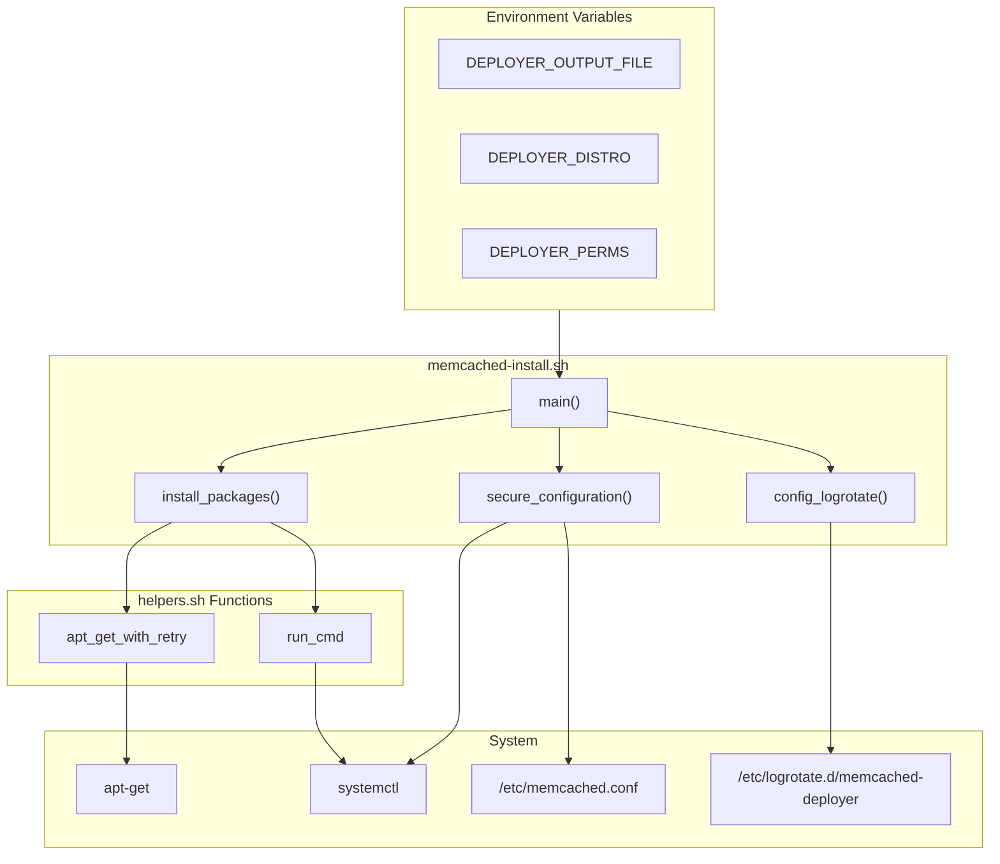

# Schematic: memcached-install.sh

> Auto-generated schematic. Last updated: 2025-12-19

## Overview

`memcached-install.sh` installs and configures Memcached server on Ubuntu/Debian servers. It handles package installation, security configuration (localhost-only binding), service management, and logrotate setup. The script is idempotent - it detects existing installations and exits gracefully.

## Logic Flow

### Entry Points

| Function | Purpose |
|----------|---------|
| `main()` | Orchestrates installation flow |

### Execution Flow

```
1. main()
   |
   +-- Check: systemctl is-active --quiet memcached
   |   |-- True: Write already_installed output, exit 0
   |
   +-- install_packages()
   |   |-- apt_get_with_retry install memcached libmemcached-tools
   |   |-- systemctl enable --quiet memcached
   |   |-- systemctl start memcached
   |   |-- verify_running (10s poll loop)
   |
   +-- secure_configuration()
   |   |-- Check /etc/memcached.conf for -l 127.0.0.1
   |   |-- If missing: add/uncomment localhost binding
   |   |-- systemctl restart memcached
   |
   +-- config_logrotate()
   |   |-- Create /etc/logrotate.d/memcached-deployer
   |
   +-- Write success output to DEPLOYER_OUTPUT_FILE
```

### Decision Points

| Location | Condition | True Branch | False Branch |
|----------|-----------|-------------|--------------|
| Line 142 | `systemctl is-active --quiet memcached` | Write already_installed, exit 0 | Continue installation |
| Line 45 | `systemctl is-enabled --quiet memcached` | Skip enable | Enable service |
| Line 53 | `systemctl is-active --quiet memcached` | Skip start | Start service |
| Line 85 | `grep -q "^-l 127.0.0.1" config` | Return (already secure) | Configure localhost binding |
| Line 92 | `grep -q "^#.*-l 127.0.0.1" config` | Uncomment existing | Add new or check for -l directive |

### Exit Conditions

| Exit Point | Condition | Exit Code |
|------------|-----------|-----------|
| Line 153 | Already installed | 0 (success) |
| Line 40-41 | apt-get install failed | 1 (failure) |
| Line 46-48 | systemctl enable failed | 1 (failure) |
| Line 55-57 | systemctl start failed | 1 (failure) |
| Line 66-68 | Service failed to start (timeout) | 1 (failure) |
| Line 101-103 | Restart after config failed | 1 (failure) |
| Line 130-133 | Logrotate config write failed | 1 (failure) |
| Line 167 | Success | 0 (success) |

## Interaction Diagram



## Dependencies

### Environment Variables (Required)

| Variable | Description |
|----------|-------------|
| `DEPLOYER_OUTPUT_FILE` | Path for YAML output |
| `DEPLOYER_DISTRO` | Distribution: `ubuntu` or `debian` |
| `DEPLOYER_PERMS` | Permissions: `root`, `sudo`, or `none` |

### Helper Functions (from helpers.sh)

| Function | Usage |
|----------|-------|
| `apt_get_with_retry` | Package installation with retry on lock |
| `run_cmd` | Execute with appropriate permissions |

### Coupled Files

| File | Coupling Type | Description |
|------|---------------|-------------|
| `playbooks/helpers.sh` | Include | Helper functions inlined at runtime |
| `/etc/memcached.conf` | Config | Memcached configuration file |
| `/etc/logrotate.d/memcached-deployer` | Config | Logrotate configuration |
| `/var/log/memcached.log` | Log | Application log file |

## Data Flow

### Inputs

| Source | Data | Description |
|--------|------|-------------|
| Environment | `DEPLOYER_PERMS` | Determines sudo usage |
| Environment | `DEPLOYER_OUTPUT_FILE` | Output file path |

### Outputs

| Destination | Data | Format |
|-------------|------|--------|
| `$DEPLOYER_OUTPUT_FILE` | Installation result | YAML |

**Output Schema:**

```yaml
# Fresh install
status: success

# Already installed
status: success
already_installed: true
```

### Side Effects

| Effect | Location | Description |
|--------|----------|-------------|
| Packages installed | System | `memcached`, `libmemcached-tools` |
| Service enabled | systemd | `memcached.service` |
| Service started | systemd | `memcached.service` |
| Config modified | `/etc/memcached.conf` | Localhost-only binding |
| Logrotate created | `/etc/logrotate.d/` | Log rotation config |

## Functions

### install_packages()

Installs Memcached and tools, enables and starts the service:

```bash
packages=(memcached libmemcached-tools)
apt_get_with_retry install -y "${packages[@]}"
systemctl enable --quiet memcached
systemctl start memcached
# 10-second verification loop
```

### secure_configuration()

Ensures Memcached only listens on localhost:

```bash
# Check for existing -l 127.0.0.1
if grep -q "^-l 127.0.0.1" /etc/memcached.conf; then
    return 0  # Already configured
fi

# Uncomment or add -l 127.0.0.1
# Restart service to apply
```

### config_logrotate()

Creates logrotate configuration:

```
/var/log/memcached.log {
    daily
    rotate 5
    maxage 30
    missingok
    notifempty
    compress
    delaycompress
    copytruncate
}
```

## Notes

### Security Configuration

The script ensures Memcached binds to `127.0.0.1` only, preventing external access. This is critical as Memcached has no authentication by default.

### Idempotency

- Checks if Memcached is already running before installation
- Checks if localhost binding is already configured
- All operations are safe to re-run

### Service Verification

Uses a 10-second polling loop to verify service started successfully, matching pattern from other service installation playbooks.

### Log File Location

Memcached logs to `/var/log/memcached.log` which is:

1. Configured for rotation via logrotate
2. Used by `MemcachedLogsCommand` for log viewing
3. Registered in `ServerLogsCommand::PORT_SOURCES`
