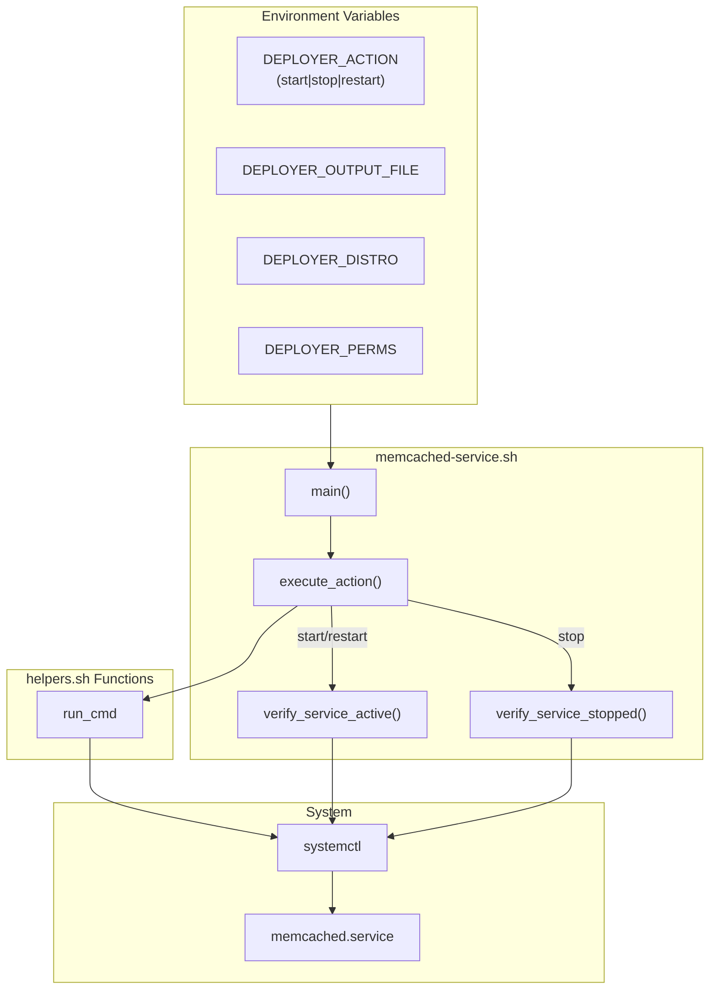

# Schematic: memcached-service.sh

> Auto-generated schematic. Last updated: 2025-12-19

## Overview

`memcached-service.sh` controls the Memcached service lifecycle (start/stop/restart) via systemctl. It validates the requested action, executes the corresponding systemctl command, and verifies the service reaches the expected state before returning success.

## Logic Flow

### Entry Points

| Function | Purpose |
|----------|---------|
| `main()` | Orchestrates service control flow |

### Execution Flow

```
1. main()
   |
   +-- execute_action()
   |   |
   |   +-- case $DEPLOYER_ACTION
   |       |-- start|restart:
   |       |   |-- systemctl $action memcached
   |       |   +-- verify_service_active()
   |       |
   |       |-- stop:
   |       |   |-- systemctl stop memcached
   |       |   +-- verify_service_stopped()
   |       |
   |       |-- *: Error "Invalid action", exit 1
   |
   +-- Write success output to DEPLOYER_OUTPUT_FILE
```

### Decision Points

| Location | Condition | True Branch | False Branch |
|----------|-----------|-------------|--------------|
| Line 34 | `$DEPLOYER_ACTION == start\|restart` | Execute and verify active | Check next case |
| Line 43 | `$DEPLOYER_ACTION == stop` | Execute and verify stopped | Invalid action error |
| Line 66 | Service active within 10s | Continue | Exit with error |
| Line 84 | Service stopped within 10s | Continue | Exit with error |

### Exit Conditions

| Exit Point | Condition | Exit Code |
|------------|-----------|-----------|
| Line 38-39 | systemctl start/restart failed | 1 (failure) |
| Line 45-46 | systemctl stop failed | 1 (failure) |
| Line 52-53 | Invalid action | 1 (failure) |
| Line 68-69 | Service failed to start (timeout) | 1 (failure) |
| Line 87-88 | Service failed to stop (timeout) | 1 (failure) |
| Line 106 | Success | 0 (success) |

## Interaction Diagram



## Dependencies

### Environment Variables (Required)

| Variable | Description |
|----------|-------------|
| `DEPLOYER_OUTPUT_FILE` | Path for YAML output |
| `DEPLOYER_DISTRO` | Distribution: `ubuntu` or `debian` |
| `DEPLOYER_PERMS` | Permissions: `root`, `sudo`, or `none` |
| `DEPLOYER_ACTION` | Action: `start`, `stop`, or `restart` |

### Helper Functions (from helpers.sh)

| Function | Usage |
|----------|-------|
| `run_cmd` | Execute with appropriate permissions |

### Coupled Files

| File | Coupling Type | Description |
|------|---------------|-------------|
| `playbooks/helpers.sh` | Include | Helper functions inlined at runtime |
| `app/Console/Memcached/MemcachedStartCommand.php` | Consumer | Calls with `DEPLOYER_ACTION=start` |
| `app/Console/Memcached/MemcachedStopCommand.php` | Consumer | Calls with `DEPLOYER_ACTION=stop` |
| `app/Console/Memcached/MemcachedRestartCommand.php` | Consumer | Calls with `DEPLOYER_ACTION=restart` |

## Data Flow

### Inputs

| Source | Data | Description |
|--------|------|-------------|
| Environment | `DEPLOYER_ACTION` | Service action to perform |
| Environment | `DEPLOYER_PERMS` | Determines sudo usage |

### Outputs

| Destination | Data | Format |
|-------------|------|--------|
| `$DEPLOYER_OUTPUT_FILE` | Operation result | YAML |

**Output Schema:**

```yaml
status: success
```

### Side Effects

| Effect | Trigger | Description |
|--------|---------|-------------|
| Service started | `DEPLOYER_ACTION=start` | Memcached process running |
| Service stopped | `DEPLOYER_ACTION=stop` | Memcached process stopped |
| Service restarted | `DEPLOYER_ACTION=restart` | Memcached process restarted |

## Functions

### execute_action()

Routes to appropriate systemctl command and verification:

```bash
case $DEPLOYER_ACTION in
    start | restart)
        run_cmd systemctl "$DEPLOYER_ACTION" memcached
        verify_service_active
        ;;
    stop)
        run_cmd systemctl stop memcached
        verify_service_stopped
        ;;
    *)
        echo "Error: Invalid action '${DEPLOYER_ACTION}'" >&2
        exit 1
        ;;
esac
```

### verify_service_active()

Polls systemctl for up to 10 seconds to confirm service is running:

```bash
local max_wait=10
local waited=0

while ! systemctl is-active --quiet memcached 2> /dev/null; do
    if ((waited >= max_wait)); then
        echo "Error: Memcached service failed to start" >&2
        exit 1
    fi
    sleep 1
    waited=$((waited + 1))
done
```

### verify_service_stopped()

Polls systemctl for up to 10 seconds to confirm service has stopped:

```bash
local max_wait=10
local waited=0

while systemctl is-active --quiet memcached 2> /dev/null; do
    if ((waited >= max_wait)); then
        echo "Error: Memcached service failed to stop" >&2
        exit 1
    fi
    sleep 1
    waited=$((waited + 1))
done
```

## Notes

### Pattern Consistency

Follows the same structure as other service control playbooks:

- `mysql-service.sh`
- `mariadb-service.sh`
- `postgresql-service.sh`
- `supervisor-service.sh`

### Verification Timeout

The 10-second timeout for service state verification balances:

- Giving the service enough time to start/stop cleanly
- Not waiting indefinitely if something goes wrong

### Error Messages

All errors are written to stderr with descriptive messages including the failed action, making debugging easier.
