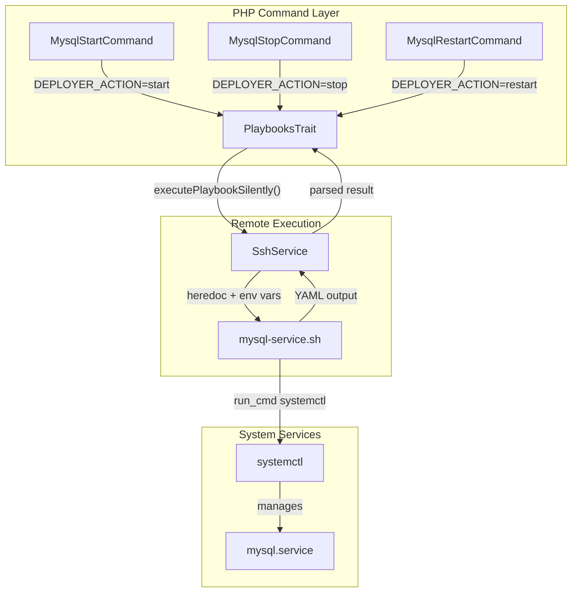
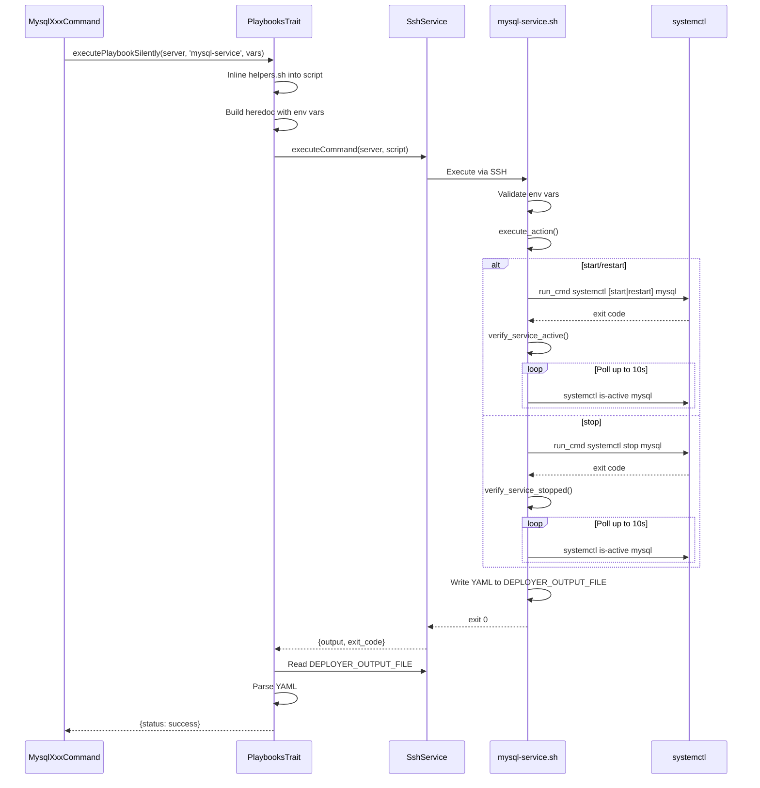

# Schematic: mysql-service.sh

> Auto-generated schematic. Last updated: 2025-12-18

## Overview

Controls MySQL service lifecycle (start/stop/restart) on remote servers via systemctl. This playbook is executed remotely by the PHP command layer through SSH, receiving the action to perform via environment variables and returning YAML status output.

## Logic Flow

### Entry Points

| Function | Description |
|----------|-------------|
| `main()` | Primary entry point, orchestrates action execution and output writing |

### Execution Flow

1. **Environment Validation** (lines 15-19)
   - Validates required environment variables: `DEPLOYER_OUTPUT_FILE`, `DEPLOYER_DISTRO`, `DEPLOYER_PERMS`, `DEPLOYER_ACTION`
   - Exits with error if any required variable is missing
   - Exports `DEPLOYER_PERMS` for use by helper functions

2. **Action Dispatch** (lines 33-56)
   - `main()` calls `execute_action()`
   - `execute_action()` uses case statement to route based on `DEPLOYER_ACTION`:
     - `start` or `restart`: Executes systemctl command, then verifies service is active
     - `stop`: Executes systemctl stop, then verifies service is stopped
     - Invalid action: Outputs error and exits

3. **Service Verification** (lines 61-91)
   - `verify_service_active()`: Polls `systemctl is-active` up to 10 seconds
   - `verify_service_stopped()`: Polls until service is no longer active, up to 10 seconds
   - Both functions exit with error if timeout reached

4. **Output Generation** (lines 101-106)
   - Writes YAML status to `DEPLOYER_OUTPUT_FILE`
   - Returns `status: success` on completion

### Decision Points

| Location | Condition | True Branch | False Branch |
|----------|-----------|-------------|--------------|
| Line 34 | `$DEPLOYER_ACTION` matches `start\|restart` | Execute systemctl, verify active | Check next case |
| Line 43 | `$DEPLOYER_ACTION` matches `stop` | Execute systemctl stop, verify stopped | Invalid action error |
| Line 37, 45 | systemctl command fails | Output error, exit 1 | Continue to verification |
| Line 67, 85 | Timeout reached (10s) | Output error, exit 1 | Continue polling |

### Exit Conditions

| Exit Code | Condition |
|-----------|-----------|
| 0 | Action completed successfully, YAML output written |
| 1 | Missing required environment variable |
| 1 | Invalid action specified |
| 1 | systemctl command failed |
| 1 | Service verification timeout (10 seconds) |
| 1 | Failed to write output file |

## Interaction Diagram

## Dependencies

### Direct Imports

| File/Module | Usage |
|-------------|-------|
| `helpers.sh` | Provides `run_cmd()` for permission-aware command execution (auto-inlined by PHP) |

### Coupled Files

| File | Coupling Type | Description |
|------|---------------|-------------|
| `app/Console/Mysql/MysqlStartCommand.php` | Command | Invokes with `DEPLOYER_ACTION=start` |
| `app/Console/Mysql/MysqlStopCommand.php` | Command | Invokes with `DEPLOYER_ACTION=stop` |
| `app/Console/Mysql/MysqlRestartCommand.php` | Command | Invokes with `DEPLOYER_ACTION=restart` |
| `app/Traits/PlaybooksTrait.php` | Execution | Handles SSH execution, env var injection, YAML parsing |
| `playbooks/mariadb-service.sh` | Pattern | Nearly identical implementation for MariaDB service |

## Data Flow

### Inputs

| Variable | Source | Description |
|----------|--------|-------------|
| `DEPLOYER_OUTPUT_FILE` | PlaybooksTrait | Unique temp file path for YAML output |
| `DEPLOYER_DISTRO` | Server info | Distribution (ubuntu\|debian) - validated but not used |
| `DEPLOYER_PERMS` | Server info | Permission level (root\|sudo\|none) - used by `run_cmd` |
| `DEPLOYER_ACTION` | Command | Service action: `start`, `stop`, or `restart` |

### Outputs

| Output | Destination | Description |
|--------|-------------|-------------|
| YAML file | `$DEPLOYER_OUTPUT_FILE` | Contains `status: success` on completion |
| stdout | SSH stream | Progress messages (e.g., "Running systemctl...") |
| stderr | SSH stream | Error messages on failure |
| exit code | SSH result | 0 on success, 1 on any failure |

### Side Effects

| Effect | Description |
|--------|-------------|
| MySQL service state change | Starts, stops, or restarts the MySQL systemd service |
| Output file creation | Creates temp file at `$DEPLOYER_OUTPUT_FILE` (cleaned up by PlaybooksTrait) |

## Notes

- **Verification Timeout**: Both `verify_service_active()` and `verify_service_stopped()` use a 10-second timeout with 1-second polling intervals. This may be insufficient for heavily loaded servers.

- **Distribution Variable**: `DEPLOYER_DISTRO` is validated as required but not actually used in the script logic. This is for consistency with other playbooks and potential future use.

- **Helper Inlining**: The `run_cmd` function from `helpers.sh` is automatically inlined by `PlaybooksTrait::executePlaybook()` before remote execution. The commented source line serves as a marker for this injection point.

- **Idempotency**: The playbook is idempotent - calling start on an already running service or stop on an already stopped service will succeed after verification.

- **Sister Script**: `mariadb-service.sh` is functionally identical, differing only in the service name (`mariadb` vs `mysql`). Changes to one should typically be mirrored to the other.
