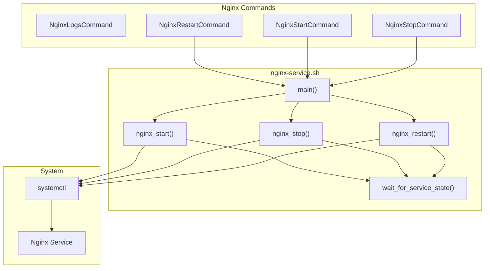

# Schematic: nginx-service.sh

> Auto-generated schematic. Last updated: 2025-12-27

## Overview

`nginx-service.sh` is a playbook that manages the Nginx web server service on remote servers. It supports starting, stopping, and restarting the Nginx service via systemctl, with verification that the service reaches the expected state within a timeout period.

## Logic Flow

### Entry Points

| Function | Purpose |
|----------|---------|
| `main()` | Entry point - dispatches to appropriate action based on `DEPLOYER_ACTION` |
| `nginx_start()` | Start Nginx service |
| `nginx_stop()` | Stop Nginx service |
| `nginx_restart()` | Restart Nginx service |

### Execution Flow

```
1. Validate required environment variables
   |- DEPLOYER_OUTPUT_FILE
   |- DEPLOYER_DISTRO
   |- DEPLOYER_PERMS
   +- DEPLOYER_ACTION

2. main()
   |
   +-- case $DEPLOYER_ACTION
       |- start   -> nginx_start()
       |- stop    -> nginx_stop()
       |- restart -> nginx_restart()
       +- *       -> fail "Unknown action"

3. nginx_{action}()
   |- run_cmd systemctl {action} nginx
   |- wait_for_service_state() with timeout
   +- fail on error

4. Write success YAML output
```

### Decision Points

| Location | Condition | True Branch | False Branch |
|----------|-----------|-------------|--------------|
| main() | `DEPLOYER_ACTION` matches case | Execute action function | Fail with unknown action |
| wait_for_service_state() | Service reaches expected state | Continue | Fail after timeout |

### Exit Conditions

| Condition | Exit Code |
|-----------|-----------|
| Missing required env var | 1 |
| Unknown action | 1 |
| systemctl command fails | 1 |
| Service state timeout | 1 |
| Success | 0 |

## Interaction Diagram



## Dependencies

### Environment Variables

| Variable | Required | Description |
|----------|----------|-------------|
| `DEPLOYER_OUTPUT_FILE` | Yes | Path to write YAML output |
| `DEPLOYER_DISTRO` | Yes | Distribution: `ubuntu\|debian` |
| `DEPLOYER_PERMS` | Yes | Permissions: `root\|sudo\|none` |
| `DEPLOYER_ACTION` | Yes | Action: `start\|stop\|restart` |

### Helper Functions (from helpers.sh)

| Function | Usage |
|----------|-------|
| `run_cmd` | Execute commands with appropriate permissions |
| `fail` | Display error and exit |

### Coupled Files

| File | Coupling Type | Description |
|------|---------------|-------------|
| `playbooks/helpers.sh` | Inlined | Helper functions are automatically inlined |
| `app/Console/Nginx/NginxStartCommand.php` | Consumer | Invokes with `DEPLOYER_ACTION=start` |
| `app/Console/Nginx/NginxStopCommand.php` | Consumer | Invokes with `DEPLOYER_ACTION=stop` |
| `app/Console/Nginx/NginxRestartCommand.php` | Consumer | Invokes with `DEPLOYER_ACTION=restart` |

## Data Flow

### Inputs

| Source | Data | Description |
|--------|------|-------------|
| Environment | `DEPLOYER_ACTION` | Action to perform |
| Environment | `DEPLOYER_PERMS` | Permission level for commands |

### Outputs

| Destination | Data | Description |
|-------------|------|-------------|
| `DEPLOYER_OUTPUT_FILE` | YAML | Status output |
| stdout | Progress messages | Action messages |
| stderr | Error messages | Failure details |

### Side Effects

| Effect | Description |
|--------|-------------|
| Service state change | Starts, stops, or restarts Nginx |
| Connection interruption | Stopping Nginx affects active connections |

## YAML Output

```yaml
status: success
```

## Notes

### Service State Verification

After issuing the systemctl command, the playbook waits for the service to reach the expected state:

- **start**: Waits for service to be `active`
- **stop**: Waits for service to be `inactive`
- **restart**: Waits for service to be `active`

Timeout is 10 seconds by default.

### Error Handling

The playbook uses `set -o pipefail` for strict error handling but does NOT use `set -e`. Errors are handled explicitly with:

- Exit code checking after systemctl commands
- Timeout verification for service state changes
- The `fail` helper for consistent error output

### Permissions

Uses `run_cmd` helper to execute systemctl commands with appropriate permissions based on `DEPLOYER_PERMS` (root vs sudo).
