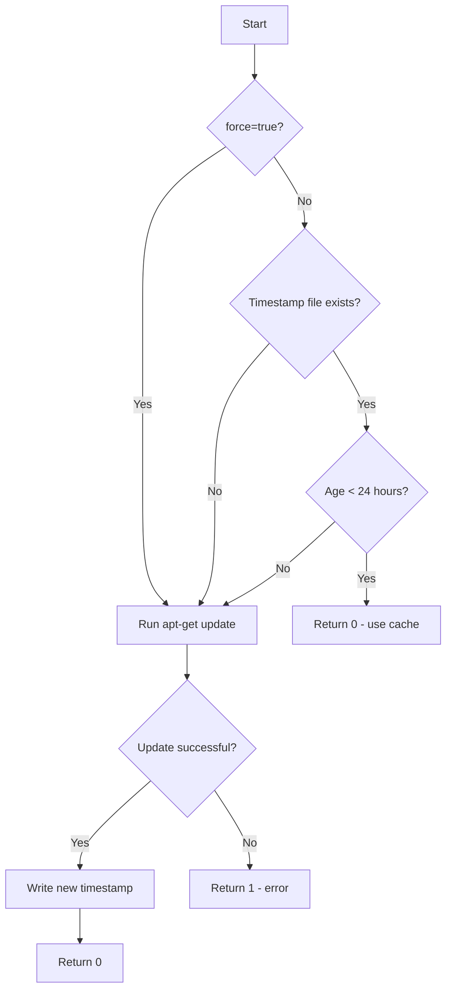
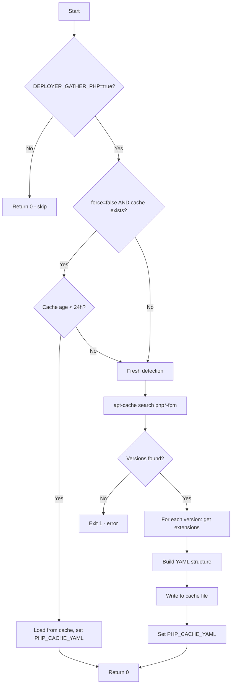

# Schematic: package-list.sh

> Auto-generated schematic. Last updated: 2025-12-18

## Overview

Configures third-party package repositories (Caddy, PHP) on Ubuntu/Debian servers and optionally gathers available PHP versions with their extensions. This playbook is typically the first step in server provisioning, ensuring all required software repositories are available before installation begins.

## Logic Flow

### Entry Points

- `main()` - Primary entry point, orchestrates repository configuration and PHP detection

### Execution Flow

1. **Environment Validation** (lines 25-28)
   - Validates required environment variables: `DEPLOYER_OUTPUT_FILE`, `DEPLOYER_DISTRO`, `DEPLOYER_PERMS`
   - Exports `DEPLOYER_PERMS` for use by helper functions

2. **Initial Package List Update** (lines 165-167)
   - Calls `smart_apt_update()` to refresh apt cache
   - Uses 24-hour timestamp-based throttling to avoid redundant updates

3. **Caddy Repository Setup** (lines 173-189)
   - Checks for existing GPG key at `/usr/share/keyrings/caddy-stable-archive-keyring.gpg`
   - Checks for existing sources list at `/etc/apt/sources.list.d/caddy-stable.list`
   - Adds GPG key and repository if missing
   - Sets `repo_added=true` if any changes made

4. **PHP Repository Setup** (lines 195-235)
   - **Ubuntu path**: Uses `ppa:ondrej/php` via `add-apt-repository`
   - **Debian path**: Uses Sury PHP repository with custom GPG key and sources list
   - Sets `repo_added=true` if any changes made

5. **Conditional Package List Refresh** (lines 241-245)
   - If repositories were added, forces a fresh `apt update` to index new packages

6. **PHP Version Detection** (lines 251-260)
   - Calls `get_php_with_cache()` with `force=true` if repos were added
   - Only executes if `DEPLOYER_GATHER_PHP=true`
   - Results stored in `PHP_CACHE_YAML` global variable

7. **YAML Output Generation** (lines 266-277)
   - Writes `status: success` and `repos_configured: true`
   - Appends PHP version/extension data if gathered

### Decision Points

| Condition | True Path | False Path |
|-----------|-----------|------------|
| `smart_apt_update()` returns non-zero | Exit with code 1 | Continue execution |
| Caddy GPG key missing | Add key, set `repo_added=true` | Skip |
| Caddy sources.list missing | Add sources, set `repo_added=true` | Skip |
| `$DEPLOYER_DISTRO == ubuntu` | Add ondrej PPA | Check for Debian path |
| `$DEPLOYER_DISTRO == debian` | Add Sury repository | Skip PHP repo (unsupported distro) |
| `$repo_added == true` | Force apt update, force PHP cache refresh | Use cached data |
| `$DEPLOYER_GATHER_PHP == 'true'` | Detect PHP versions | Skip PHP detection |
| PHP cache age < 24 hours | Return cached YAML | Fresh detection |

### Exit Conditions

- **Exit 1**: Missing required environment variables
- **Exit 1**: Failed to update package lists (`smart_apt_update` failure)
- **Exit 1**: Failed to add Caddy GPG key or repository
- **Exit 1**: Failed to add PHP PPA (Ubuntu) or Sury repository (Debian)
- **Exit 1**: No PHP versions found when `DEPLOYER_GATHER_PHP=true`
- **Exit 1**: Failed to write output file
- **Exit 0**: Success via `main()` completion

## Interaction Diagram

```mermaid
flowchart TD
    subgraph "PHP Layer"
        SIC[ServerInstallCommand]
        PT[PlaybooksTrait]
    end

    subgraph "package-list.sh"
        MAIN[main]
        SAU[smart_apt_update]
        GPC[get_php_with_cache]
    end

    subgraph "helpers.sh (inlined)"
        RC[run_cmd]
        AGR[apt_get_with_retry]
    end

    subgraph "External Services"
        APT[apt-get]
        CURL[curl]
        GPG[gpg]
        APTCACHE[apt-cache]
    end

    subgraph "Cache Files"
        APTTS[/tmp/deployer-apt-last-update]
        PHPCACHE[/tmp/deployer-php-cache]
    end

    subgraph "System Files"
        CADDY_KEY[/usr/share/keyrings/caddy-stable-archive-keyring.gpg]
        CADDY_SRC[/etc/apt/sources.list.d/caddy-stable.list]
        PHP_KEY[/usr/share/keyrings/php-sury-archive-keyring.gpg]
        PHP_SRC[/etc/apt/sources.list.d/php-sury.list]
    end

    SIC -->|executePlaybook| PT
    PT -->|SSH execute| MAIN

    MAIN --> SAU
    SAU --> RC
    RC --> AGR
    AGR --> APT
    SAU -.-> APTTS

    MAIN --> GPC
    GPC --> APTCACHE
    GPC -.-> PHPCACHE

    MAIN -->|Caddy setup| CURL
    CURL --> GPG
    GPG --> CADDY_KEY
    CURL --> CADDY_SRC

    MAIN -->|PHP setup| PHP_KEY
    MAIN -->|PHP setup| PHP_SRC
```

## Dependencies

### Direct Imports

| File/Module | Usage |
|-------------|-------|
| `helpers.sh` | Inlined at runtime; provides `run_cmd`, `apt_get_with_retry` functions |

### Coupled Files

| File | Coupling Type | Description |
|------|---------------|-------------|
| `/tmp/deployer-apt-last-update` | Cache | Timestamp file for apt update throttling (24h TTL) |
| `/tmp/deployer-php-cache` | Cache | PHP versions/extensions cache with timestamp header |
| `/usr/share/keyrings/caddy-stable-archive-keyring.gpg` | State | Caddy GPG key (presence check for idempotency) |
| `/etc/apt/sources.list.d/caddy-stable.list` | Config | Caddy apt sources (presence check for idempotency) |
| `/usr/share/keyrings/php-sury-archive-keyring.gpg` | State | Sury PHP GPG key - Debian only |
| `/etc/apt/sources.list.d/php-sury.list` | Config | Sury PHP sources - Debian only |
| `playbooks/php-install.sh` | Data | Consumes PHP version data from this playbook's output |
| `playbooks/base-install.sh` | Event | Runs after this playbook configures repositories |

## Data Flow

### Inputs

| Variable | Required | Description |
|----------|----------|-------------|
| `DEPLOYER_OUTPUT_FILE` | Yes | Path for YAML output file |
| `DEPLOYER_DISTRO` | Yes | Distribution: `ubuntu` or `debian` |
| `DEPLOYER_PERMS` | Yes | Permission level: `root`, `sudo`, or `none` |
| `DEPLOYER_GATHER_PHP` | No | Set to `true` to detect PHP versions |

### Outputs

**Minimal output (DEPLOYER_GATHER_PHP not set):**

```yaml
status: success
repos_configured: true
```

**Full output (DEPLOYER_GATHER_PHP=true):**

```yaml
status: success
repos_configured: true
php:
  "8.4":
    extensions:
      - bcmath
      - cli
      - curl
      # ... more extensions
  "8.3":
    extensions:
      - bcmath
      - cli
      # ... more extensions
```

### Side Effects

| Effect | Location | Description |
|--------|----------|-------------|
| GPG key file | `/usr/share/keyrings/` | Caddy and optionally PHP Sury keys |
| Apt sources | `/etc/apt/sources.list.d/` | Caddy and PHP repository definitions |
| Timestamp cache | `/tmp/deployer-apt-last-update` | Tracks last apt update time |
| PHP cache | `/tmp/deployer-php-cache` | Caches detected PHP versions (24h) |
| Apt database | `/var/lib/apt/lists/` | Updated package indexes |

## Helper Functions

### smart_apt_update()

**Purpose:** Rate-limited apt package list update with 24-hour throttling.

**Arguments:**

- `$1` (optional): `true` to force update, bypassing throttle

**Returns:** 0 on success, 1 on failure

**Flow:**



### get_php_with_cache()

**Purpose:** Detects available PHP versions and extensions with 24-hour caching.

**Arguments:**

- `$1` (optional): `true` to bypass cache

**Side Effects:** Sets `PHP_CACHE_YAML` global variable with YAML structure

**Flow:**



## Notes

- **Idempotency**: All repository additions check for existing files before acting, making the script safe to run multiple times
- **Distribution Support**: Only Ubuntu and Debian are supported; other distributions will silently skip PHP repository setup
- **Cache Strategy**: Both apt updates and PHP detection use 24-hour caching to minimize network calls on repeated runs
- **Cache Invalidation**: Adding new repositories automatically invalidates both caches by passing `force=true`
- **PHP Version Filtering**: The regex `^php[0-9]+\.[0-9]+-fpm$` ensures only valid PHP version packages are detected
- **Error Handling**: All external commands (curl, gpg, apt operations) have explicit error checking with descriptive messages
- **Non-Interactive**: Uses `DEBIAN_FRONTEND=noninteractive` and `--batch --yes` flags to prevent any prompts
