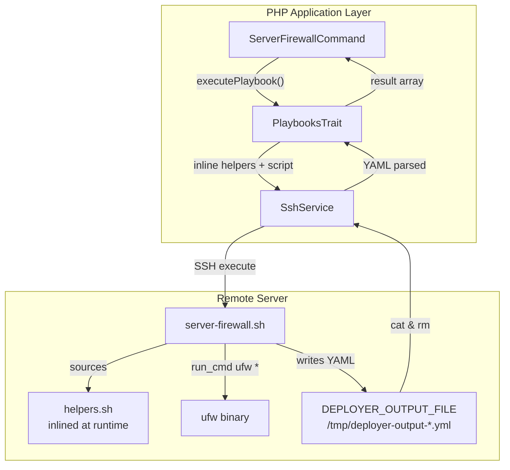
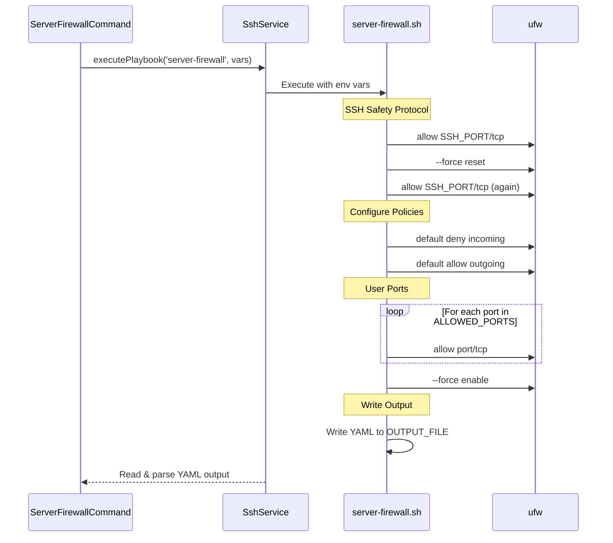

# Schematic: server-firewall.sh

> Auto-generated schematic. Last updated: 2025-12-18

## Overview

Configures UFW (Uncomplicated Firewall) on a remote server with user-specified allowed ports. The script follows a critical SSH-safe sequence to prevent accidental lockout during firewall reconfiguration, always ensuring SSH access is preserved before and after rule changes.

## Logic Flow

### Entry Points

| Entry Point | Description |
|-------------|-------------|
| `main()` | Primary entry point, orchestrates the entire firewall configuration |

### Execution Flow

```
1. main() invoked with script arguments
   |
2. SSH Safety: allow_ssh_port() - Allow SSH before any changes
   |
3. reset_ufw() - Clear all existing UFW rules
   |
4. allow_ssh_port() - Re-allow SSH immediately after reset
   |
5. set_default_policies() - Set deny incoming, allow outgoing
   |
6. allow_selected_ports() - Allow user-specified ports
   |
7. enable_ufw() - Enable the firewall
   |
8. Write YAML output to $DEPLOYER_OUTPUT_FILE
```

### Decision Points

| Location | Condition | Branch |
|----------|-----------|--------|
| L22-25 | Missing required env vars | Exit with error message |
| L39 | SSH port allow fails | Silently continues (|| true) |
| L64-70 | For each port in DEPLOYER_ALLOWED_PORTS | Allow TCP traffic on port |
| L113-122 | YAML write fails | Exit with error to stderr |
| L127-130 | Port append fails | Exit with error to stderr |

### Exit Conditions

| Condition | Exit Code | Output |
|-----------|-----------|--------|
| Missing `DEPLOYER_OUTPUT_FILE` | 1 | Error message to stdout |
| Missing `DEPLOYER_PERMS` | 1 | Error message to stdout |
| Missing `DEPLOYER_SSH_PORT` | 1 | Error message to stdout |
| Missing `DEPLOYER_ALLOWED_PORTS` | 1 | Error message to stdout |
| UFW reset fails | 1 | Error via `fail()` helper |
| Default policy fails | 1 | Error via `fail()` helper |
| Port allow fails | 1 | Error via `fail()` helper |
| UFW enable fails | 1 | Error via `fail()` helper |
| YAML output write fails | 1 | Error to stderr |
| Successful completion | 0 | YAML output written |

## Interaction Diagram



### Firewall Configuration Sequence



## Dependencies

### Direct Imports

| File/Module | Usage |
|-------------|-------|
| `helpers.sh` | Provides `run_cmd()` and `fail()` functions (inlined at runtime by PlaybooksTrait) |

### Coupled Files

| File | Coupling Type | Description |
|------|---------------|-------------|
| `app/Console/Server/ServerFirewallCommand.php` | Invocation | PHP command that invokes this playbook via PlaybooksTrait |
| `app/Traits/PlaybooksTrait.php` | Runtime | Prepends helpers.sh and executes script via SSH |
| `playbooks/helpers.sh` | Runtime | Helper functions inlined before execution |

### Helper Functions Used

| Function | Source | Purpose |
|----------|--------|---------|
| `run_cmd` | helpers.sh | Execute commands with appropriate permissions (root or sudo) |
| `fail` | helpers.sh | Print error message and exit with code 1 |

## Data Flow

### Inputs

| Variable | Required | Description | Example |
|----------|----------|-------------|---------|
| `DEPLOYER_OUTPUT_FILE` | Yes | Path for YAML output | `/tmp/deployer-output-1702918800-abc123.yml` |
| `DEPLOYER_PERMS` | Yes | Permission level (root/sudo/none) | `sudo` |
| `DEPLOYER_SSH_PORT` | Yes | SSH port to always allow | `22` |
| `DEPLOYER_ALLOWED_PORTS` | Yes | Comma-separated ports to allow | `80,443,3306` |

### Outputs

YAML file written to `DEPLOYER_OUTPUT_FILE`:

```yaml
status: success
ufw_installed: true
ufw_enabled: true
rules_applied: 3
ports_allowed:
  - 80
  - 443
  - 3306
```

| Field | Type | Description |
|-------|------|-------------|
| `status` | string | Always "success" on completion |
| `ufw_installed` | boolean | Always true (assumed pre-installed) |
| `ufw_enabled` | boolean | Always true after successful enable |
| `rules_applied` | integer | Count of user-selected ports |
| `ports_allowed` | array | List of allowed ports (from DEPLOYER_ALLOWED_PORTS) |

### Side Effects

| Effect | Description |
|--------|-------------|
| UFW rules reset | All existing firewall rules are cleared |
| UFW policies set | Default deny incoming, allow outgoing |
| Ports opened | SSH port + user-selected ports allowed (TCP) |
| UFW enabled | Firewall activated with new rules |

## Notes

### SSH Safety Protocol

The script implements a critical safety sequence to prevent SSH lockout:

1. **Pre-reset SSH allow** (L89): Ensures SSH access before clearing rules
2. **UFW reset** (L92): Clears all rules including the just-added SSH rule
3. **Post-reset SSH allow** (L95): Immediately re-adds SSH after reset
4. **User ports** (L101): Only after SSH is guaranteed safe

This pattern is essential because `ufw --force reset` clears ALL rules, including the SSH rule added in step 1.

### Port Handling

- SSH port is always allowed automatically (via `DEPLOYER_SSH_PORT`)
- User cannot accidentally remove SSH access
- Only TCP traffic is allowed (`port/tcp`)
- UFW handles IPv4/IPv6 automatically

### Idempotency

The script is fully idempotent:

- `ufw --force reset` ensures clean slate
- Re-running produces identical results
- No state accumulation between runs

### Error Handling

- Initial SSH allow uses `|| true` to prevent failure if UFW is not active
- All subsequent commands use `|| fail` for explicit error handling
- YAML write operations have explicit error checks with stderr output
