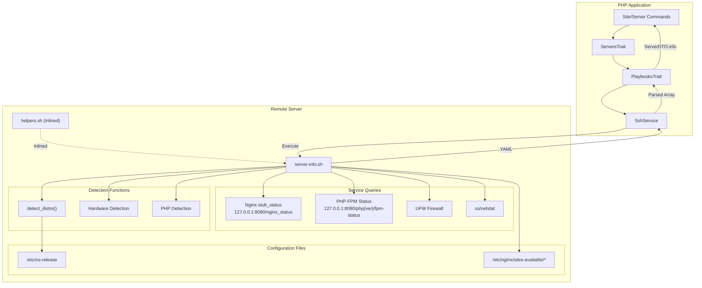

# Schematic: server-info.sh

> Auto-generated schematic. Last updated: 2025-12-27

## Recent Changes

- **2025-12-27**: Migrated from Caddy to Nginx. Replaced `get_caddy_metrics()` with `get_nginx_metrics()` that queries Nginx stub_status endpoint at `127.0.0.1:8080/nginx_status`. Changed `get_sites_config()` to parse Nginx vhosts from `/etc/nginx/sites-available/` instead of Caddy configs. Updated PHP-FPM status endpoint to use port 8080 (Nginx status server) instead of 9001.

## Overview

Remote bash script that gathers comprehensive server information including Linux distribution, hardware specs, installed PHP versions with extensions, Nginx web server metrics, PHP-FPM pool status, firewall configuration, and site configurations. This is a foundational playbook used by many commands to validate server connectivity and retrieve system state.

## Logic Flow

### Entry Points

| Function | Purpose |
|----------|---------|
| `main()` | Orchestrates all detection functions and writes YAML output |

### Execution Flow

```
main()
  |
  +-- Validation
  |     +-- Check DEPLOYER_OUTPUT_FILE is set (exit 1 if missing)
  |
  +-- Distribution Detection (lines 487-489)
  |     +-- detect_distro() -> ubuntu|debian|fedora|centos|rocky|alma|rhel|amazon|unknown
  |     +-- detect_family(distro) -> debian|fedora|redhat|amazon|unknown
  |
  +-- Permission Check (line 492-493)
  |     +-- check_permissions() -> root|sudo|none
  |
  +-- Hardware Detection (lines 494-497)
  |     +-- detect_cpu_cores() -> integer (nproc)
  |     +-- detect_ram_mb() -> integer (free -m)
  |     +-- detect_disk_type() -> ssd|hdd
  |
  +-- PHP Detection (lines 499-501)
  |     +-- detect_php_versions() -> comma-separated versions (e.g., "8.2,8.3,8.4")
  |     +-- detect_php_default() -> default version (from helpers.sh)
  |
  +-- Nginx Metrics (lines 499-504)
  |     +-- get_nginx_metrics() -> version, sites, uptime, active_connections, requests
  |     +-- Queries 127.0.0.1:8080/nginx_status (stub_status endpoint)
  |
  +-- PHP-FPM Metrics (lines 506-533)
  |     +-- get_php_fpm_metrics(version) for each installed PHP version
  |     +-- Queries 127.0.0.1:8080/php{version}/fpm-status
  |
  +-- Firewall Status (lines 542-550)
  |     +-- check_ufw_installed() -> true|false
  |     +-- check_ufw_active() -> true|false
  |
  +-- YAML Output Generation (lines 555-707)
  |     +-- Write header (distro, family, permissions, hardware)
  |     +-- Write PHP versions with extensions
  |     +-- Write Caddy metrics
  |     +-- Write PHP-FPM metrics
  |     +-- Write listening ports (get_listening_services from helpers.sh)
  |     +-- Write UFW rules (get_ufw_rules)
  |     +-- Write site configurations (get_sites_config)
  |
  +-- Exit 0 on success
```

### Decision Points

| Location | Condition | Branches |
|----------|-----------|----------|
| Line 42-45 | `DEPLOYER_OUTPUT_FILE` empty | Exit 1 with error |
| Lines 65-90 | OS release file detection | `/etc/os-release` -> `/etc/redhat-release` -> `/etc/debian_version` -> unknown |
| Lines 71-76 | Distro normalization | Normalize almalinux, rocky, rhel, amzn to standard names |
| Lines 131-137 | Permission level | `EUID == 0` -> root, `sudo -n` success -> sudo, else -> none |
| Lines 170-184 | Disk type detection | Check TRIM support first (reliable for VMs), fallback to rotation flag |
| Nginx metrics | Nginx not installed | Return "false" |
| Nginx metrics | Nginx not running | Return available but no metrics |
| PHP-FPM metrics per version | Query each version, accumulate YAML if available |
| Lines 546-550 | UFW status | Only check active if installed |
| Lines 657-679 | UFW rules | Only output rules if UFW installed AND active |

### Exit Conditions

| Exit Code | Condition |
|-----------|-----------|
| 1 | `DEPLOYER_OUTPUT_FILE` not set |
| 1 | Failed to write any section to output file |
| 0 | Successful completion with YAML output |

## Interaction Diagram



## Dependencies

### Direct Imports

| File/Function | Usage |
|---------------|-------|
| `helpers.sh` | Provides `detect_php_default()`, `get_listening_services()`, `run_cmd()` - auto-inlined at execution |

### Helper Functions Used

| Function | Source | Purpose |
|----------|--------|---------|
| `detect_php_default()` | helpers.sh | Get default PHP version via update-alternatives |
| `get_listening_services()` | helpers.sh | Get port:process pairs via ss/netstat |
| `run_cmd()` | helpers.sh | Execute commands with appropriate permissions (root/sudo) |

### System Commands

| Command | Purpose |
|---------|---------|
| `nproc` | Get CPU core count |
| `free -m` | Get RAM in MB |
| `lsblk` | Detect disk type (TRIM support, rotation) |
| `curl` | Query Nginx stub_status and PHP-FPM status |
| `nginx -v` | Get Nginx version string |
| `pgrep`, `ps` | Get Nginx process uptime and memory |
| `ufw status` | Get firewall status and rules |
| `ss` / `netstat` | Get listening services |
| `grep`, `awk`, `sed` | Parse various outputs |

### Coupled Files

| File | Coupling Type | Description |
|------|---------------|-------------|
| `playbooks/helpers.sh` | Code | Helper functions inlined by PlaybooksTrait before execution |
| `/etc/os-release` | Config | Read to detect Linux distribution |
| `/etc/redhat-release` | Config | Fallback for older RHEL-based systems |
| `/etc/debian_version` | Config | Fallback for Debian detection |
| `/etc/nginx/sites-available/*` | Config | Parsed to extract site configurations |
| `/etc/nginx/sites-enabled/*` | Config | Symlinks used to count enabled sites |
| `/usr/bin/php*` | Binary | Scanned to detect installed PHP versions |
| `app/Traits/ServersTrait.php` | Code | Calls this playbook via `getServerInfo()` |
| `app/Traits/PlaybooksTrait.php` | Code | Handles execution, helper inlining, and YAML parsing |
| `app/DTOs/ServerDTO.php` | Data | Output stored in `ServerDTO->info` property |

## Data Flow

### Inputs

| Source | Data | Purpose |
|--------|------|---------|
| `DEPLOYER_OUTPUT_FILE` | Environment variable | Path to write YAML output |
| `/etc/os-release` | File | Distribution identification |
| Nginx stub_status | HTTP `127.0.0.1:8080/nginx_status` | Web server metrics |
| PHP-FPM Status | HTTP `127.0.0.1:8080/php{ver}/fpm-status` | FPM pool metrics |
| `ufw status` | Command output | Firewall configuration |
| Site config files | Files | Per-site PHP version and HTTPS status |

### Outputs

YAML file written to `$DEPLOYER_OUTPUT_FILE`:

```yaml
distro: ubuntu                    # Exact distribution name
family: debian                    # Distribution family
permissions: root                 # User permission level
hardware:
  cpu_cores: 4                    # Number of CPU cores
  ram_mb: 8192                    # Total RAM in MB
  disk_type: ssd                  # Storage type
php:
  default: "8.4"                  # Default PHP version
  versions:
    - version: "8.4"
      extensions: [cli, fpm, mysql, curl, ...]
nginx:
  available: true                 # Nginx is installed
  version: 1.24.0                 # Nginx version
  sites_count: 2                  # Number of enabled sites
  uptime_seconds: 86400           # Process uptime
  active_connections: 5           # Current active connections
  requests: 12345                 # Total requests served
php_fpm:
  "8.4":
    pool: www
    process_manager: dynamic
    uptime_seconds: 86400
    accepted_conn: 5000
    listen_queue: 0
    idle_processes: 2
    active_processes: 1
    total_processes: 3
    max_children_reached: 0
    slow_requests: 0
ports:
  22: sshd
  80: nginx
  443: nginx
ufw_installed: true
ufw_active: true
ufw_rules:
  - 22/tcp
  - 80/tcp
  - 443/tcp
sites_config:
  example.com:
    php_version: "8.4"
    www_mode: "redirect-to-root"
    https_enabled: "true"
```

### Side Effects

| Action | Description |
|--------|-------------|
| File write | Creates/overwrites `$DEPLOYER_OUTPUT_FILE` with YAML |
| Network requests | Queries Nginx stub_status endpoint on 127.0.0.1:8080 |
| Network requests | Queries PHP-FPM status endpoints on 127.0.0.1:8080 |
| Process inspection | Reads process info via `ps` for Nginx metrics |

## Function Reference

### Detection Functions

| Function | Lines | Returns | Description |
|----------|-------|---------|-------------|
| `detect_distro()` | 62-93 | string | Detect exact Linux distribution name |
| `detect_family()` | 99-119 | string | Map distribution to family (debian/fedora/redhat/amazon) |
| `check_permissions()` | 130-138 | string | Check if running as root, with sudo, or unprivileged |
| `detect_cpu_cores()` | 151-153 | int | Get CPU core count via nproc |
| `detect_ram_mb()` | 158-160 | int | Get total RAM in MB via free |
| `detect_disk_type()` | 165-185 | string | Detect SSD vs HDD via TRIM support or rotation |
| `detect_php_versions()` | 194-212 | string | Find installed PHP versions from /usr/bin/php* |
| `detect_php_extensions()` | 217-235 | string | Get extensions for a PHP version via php -m |

### Service Metrics Functions

| Function | Returns | Description |
|----------|---------|-------------|
| `get_nginx_metrics()` | TSV string | Query Nginx stub_status for version, sites, connections, requests |
| `get_php_fpm_metrics()` | TSV string | Query PHP-FPM status endpoint for pool metrics |

### Firewall Functions

| Function | Lines | Returns | Description |
|----------|-------|---------|-------------|
| `check_ufw_installed()` | 365-371 | string | Check if ufw command exists |
| `check_ufw_active()` | 377-387 | string | Check if UFW firewall is active |
| `get_ufw_rules()` | 393-414 | lines | Parse UFW rules as port/proto pairs |

### Site Configuration

| Function | Returns | Description |
|----------|---------|-------------|
| `get_sites_config()` | TSV lines | Parse Nginx site configs for PHP version, www mode, HTTPS |

## Notes

- This playbook is the foundation for server validation - most site commands call it first via `getServerInfo()`
- The playbook does NOT require `DEPLOYER_DISTRO` or `DEPLOYER_PERMS` as input (unlike most playbooks) since its purpose is to detect these values
- Tab-separated values (TSV) are used for complex function returns to avoid delimiter conflicts
- Nginx metrics require stub_status endpoint configured at `127.0.0.1:8080/nginx_status` (set up by `base-install.sh`)
- PHP-FPM metrics require status endpoint exposure via the FPM pool configuration
- Hardware detection uses TRIM support (disc-gran) as primary SSD indicator since it works reliably in virtualized environments
- The `detect_php_default()` function is provided by helpers.sh, not defined in this file
- Site configuration parsing supports both "redirect-to-root" and "redirect-to-www" modes
- HTTPS detection checks for `listen.*443.*ssl` directive in Nginx configs
