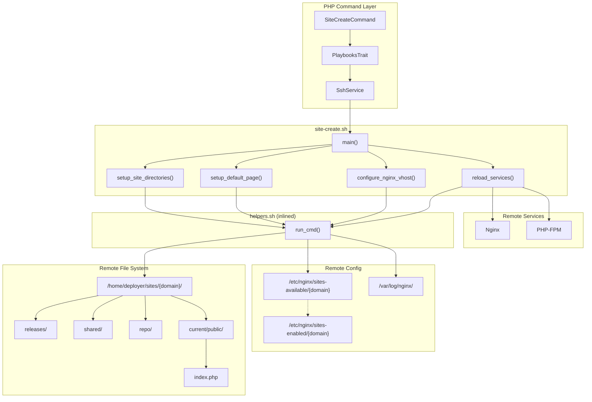
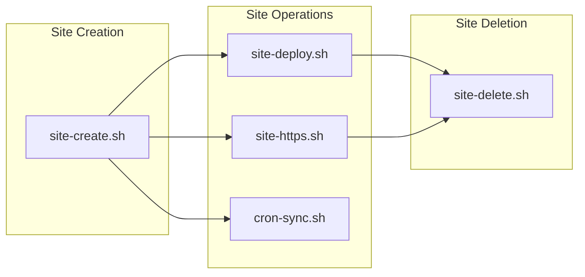

# Schematic: site-create.sh

> Auto-generated schematic. Last updated: 2025-12-27

## Recent Changes

- **2025-12-27**: Migrated from Caddy to Nginx - now creates Nginx vhost in `/etc/nginx/sites-available/{domain}` with symlink to `sites-enabled/`. Uses FastCGI proxy to PHP-FPM socket. Log path changed to `/var/log/nginx/{domain}-access.log`.

## Overview

Creates a new site on a remote server by setting up the atomic deployment directory structure, creating a default placeholder page, configuring an Nginx virtual host, and reloading services. This playbook is the foundation for the site lifecycle - subsequent operations like `site-deploy.sh` and `site-https.sh` depend on the structure created here.

## Logic Flow

### Entry Points

| Function | Description |
|----------|-------------|
| `main()` | Orchestrates site creation by calling setup functions in sequence |

### Execution Flow

```
main()
 |
 +-- setup_site_directories($domain)
 |   |-- Create /home/deployer/sites/{domain}
 |   |-- Create releases/, shared/, repo/, current/public/
 |   |-- Set ownership: deployer:deployer
 |   +-- Set directory permissions: 755
 |
 +-- setup_default_page($domain)
 |   |-- Create index.php placeholder in current/public/
 |   |-- Set file permissions: 640
 |   +-- Set ownership: deployer:deployer
 |
 +-- configure_nginx_vhost($domain)
 |   |-- Create /var/log/nginx if needed
 |   |-- Build Nginx server block (root, gzip, logging, fastcgi_pass to PHP-FPM socket)
 |   |-- Branch on DEPLOYER_WWW_MODE:
 |   |   |-- redirect-to-root: www.{domain} -> {domain}
 |   |   +-- redirect-to-www: {domain} -> www.{domain}
 |   |-- Write config to /etc/nginx/sites-available/{domain}
 |   +-- Create symlink /etc/nginx/sites-enabled/{domain}
 |
 +-- reload_services()
 |   |-- Enable Nginx if not enabled
 |   |-- Reload Nginx if running, else start
 |   +-- Restart PHP-FPM (optional, warning on failure)
 |
 +-- Write YAML output file
```

### Decision Points

| Location | Condition | True Branch | False Branch |
|----------|-----------|-------------|--------------|
| L47 | Directory exists | Skip creation | Create with mkdir -p |
| L63-68 | Sub-directory exists | Skip creation | Create with mkdir -p |
| L98 | index.php exists | Skip creation | Create placeholder |
| /var/log/nginx exists | Skip creation | Create with mkdir -p |
| WWW mode | Configure redirect pattern | Error and exit |
| Nginx enabled | Skip enable | systemctl enable |
| Nginx active | Reload service | Start service |
| PHP-FPM active | Restart service | Skip (silent) |

### Exit Conditions

| Exit Point | Condition | Exit Code |
|------------|-----------|-----------|
| L18-23 | Missing required env var | 1 |
| L49-51 | Failed to create site directory | 1 |
| L64-68 | Failed to create sub-directory | 1 |
| L72-75 | Failed to set ownership | 1 |
| L79-82 | Failed to set permissions | 1 |
| L106-108 | Failed to create index.php | 1 |
| L112-115 | Failed to chmod index.php | 1 |
| L118-121 | Failed to chown index.php | 1 |
| Failed to create log directory | 1 |
| Failed to chown log directory | 1 |
| Invalid WWW mode | 1 |
| Failed to write Nginx config | 1 |
| Failed to create symlink | 1 |
| Failed to enable Nginx | 1 |
| Failed to reload Nginx | 1 |
| Failed to start Nginx | 1 |
| Failed to write output file | 1 |

## Interaction Diagram



## Site Lifecycle Diagram



## Dependencies

### Direct Imports

| File/Class | Usage |
|------------|-------|
| `helpers.sh` | Provides `run_cmd()` for permission-aware command execution |

### Coupled Files

| File | Coupling Type | Description |
|------|---------------|-------------|
| `app/Console/Site/SiteCreateCommand.php` | Command | PHP command that invokes this playbook via SSH |
| `playbooks/helpers.sh` | Helper | Inlined at execution time for `run_cmd()` |
| `playbooks/site-delete.sh` | Lifecycle | Reverses this playbook's actions (removes dirs and config) |
| `playbooks/site-https.sh` | Lifecycle | Runs Certbot on Nginx config created here for HTTPS |
| `playbooks/site-deploy.sh` | Lifecycle | Uses directory structure created here (releases/, shared/, repo/) |
| `/etc/nginx/sites-available/{domain}` | Config | Vhost configuration file created by this playbook |
| `/etc/nginx/sites-enabled/{domain}` | Config | Symlink to enable the vhost |
| `/home/deployer/sites/{domain}/` | Data | Site root directory created by this playbook |
| `/var/log/nginx/{domain}-access.log` | Log | Access log configured in Nginx vhost |

## Data Flow

### Inputs

| Source | Variable | Description |
|--------|----------|-------------|
| Environment | `DEPLOYER_OUTPUT_FILE` | Path for YAML output file |
| Environment | `DEPLOYER_DISTRO` | Linux distribution (ubuntu/debian) |
| Environment | `DEPLOYER_PERMS` | Permission level (root/sudo/none) |
| Environment | `DEPLOYER_SITE_DOMAIN` | Domain name for the site |
| Environment | `DEPLOYER_PHP_VERSION` | PHP version for FPM socket |
| Environment | `DEPLOYER_WWW_MODE` | WWW redirect mode (redirect-to-root/redirect-to-www) |

### Outputs

| Destination | Data | Format |
|-------------|------|--------|
| `$DEPLOYER_OUTPUT_FILE` | Execution result | YAML |
| `/home/deployer/sites/{domain}/` | Directory structure | Filesystem |
| `/etc/nginx/sites-available/{domain}` | Vhost config | Nginx config |
| `/etc/nginx/sites-enabled/{domain}` | Symlink | Symlink to sites-available |
| stdout | Progress messages | Text with `->` prefix |
| stderr | Error messages | Text with `Error:` prefix |

### YAML Output Schema

```yaml
status: success
site_path: /home/deployer/sites/example.com
site_configured: true
php_version: "8.4"
```

### Side Effects

| Effect | Location | Trigger |
|--------|----------|---------|
| Directory creation | `/home/deployer/sites/{domain}/` | `setup_site_directories()` |
| Directory creation | `releases/`, `shared/`, `repo/`, `current/public/` | `setup_site_directories()` |
| File creation | `current/public/index.php` | `setup_default_page()` |
| Directory creation | `/var/log/nginx/` | `configure_nginx_vhost()` |
| Config creation | `/etc/nginx/sites-available/{domain}` | `configure_nginx_vhost()` |
| Symlink creation | `/etc/nginx/sites-enabled/{domain}` | `configure_nginx_vhost()` |
| Service enable | Nginx systemd unit | `reload_services()` |
| Service reload/start | Nginx | `reload_services()` |
| Service restart | PHP-FPM | `reload_services()` |

## Directory Structure Created

```
/home/deployer/sites/{domain}/
├── releases/           # Timestamped release directories (used by site-deploy.sh)
├── shared/             # Persistent shared files (linked into releases)
├── repo/               # Bare git repository (used by site-deploy.sh)
└── current/            # Symlink to active release (initially real directory)
    └── public/         # Web root served by Nginx
        └── index.php   # Default placeholder page
```

## Nginx Configuration Template

The generated Nginx vhost follows this structure:

```nginx
# Site: {domain} (Redirect www -> root)
server {
    listen 80;
    server_name www.{domain};
    return 301 http://{domain}$request_uri;
}

server {
    listen 80;
    server_name {domain};

    root /home/deployer/sites/{domain}/current/public;
    index index.php index.html;

    access_log /var/log/nginx/{domain}-access.log;
    error_log /var/log/nginx/{domain}-error.log;

    gzip on;
    gzip_types text/plain text/css application/json application/javascript;

    location / {
        try_files $uri $uri/ /index.php?$query_string;
    }

    location ~ \.php$ {
        fastcgi_pass unix:/run/php/php{version}-fpm.sock;
        fastcgi_param SCRIPT_FILENAME $realpath_root$fastcgi_script_name;
        include fastcgi_params;
    }
}
```

Note: Site is HTTP-only initially. `site-https.sh` runs Certbot to add HTTPS configuration.

## Notes

### Idempotency

The playbook is idempotent - all directory and file operations check for existence before creation. Running it multiple times on the same domain will not cause errors or duplicate resources.

### WWW Mode Handling

Two redirect modes are supported:

- `redirect-to-root`: Canonical URL is `example.com`, redirects `www.example.com`
- `redirect-to-www`: Canonical URL is `www.example.com`, redirects `example.com`

The mode affects both the redirect rule and which domain block contains the full site configuration.

### PHP-FPM Socket Path

The playbook hardcodes the Debian/Ubuntu socket path pattern: `/run/php/php{version}-fpm.sock`. This is consistent with the project's target distributions.

### Permission Model

- Directories: 755 (owner rwx, group+others rx) - allows git and other tools to traverse
- Files (index.php): 640 (owner rw, group r) - PHP-FPM can read via group membership
- Ownership: `deployer:deployer` for all site files

### Relationship to Other Playbooks

1. **site-deploy.sh**: Uses `releases/`, `shared/`, `repo/` directories; replaces `current/` symlink
2. **site-https.sh**: Runs Certbot with Nginx plugin to obtain SSL certificate and modify config
3. **site-delete.sh**: Removes `/home/deployer/sites/{domain}/`, `/etc/nginx/sites-available/{domain}`, `/etc/nginx/sites-enabled/{domain}`, and SSL certificates
