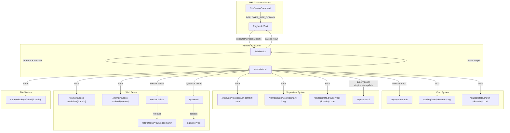
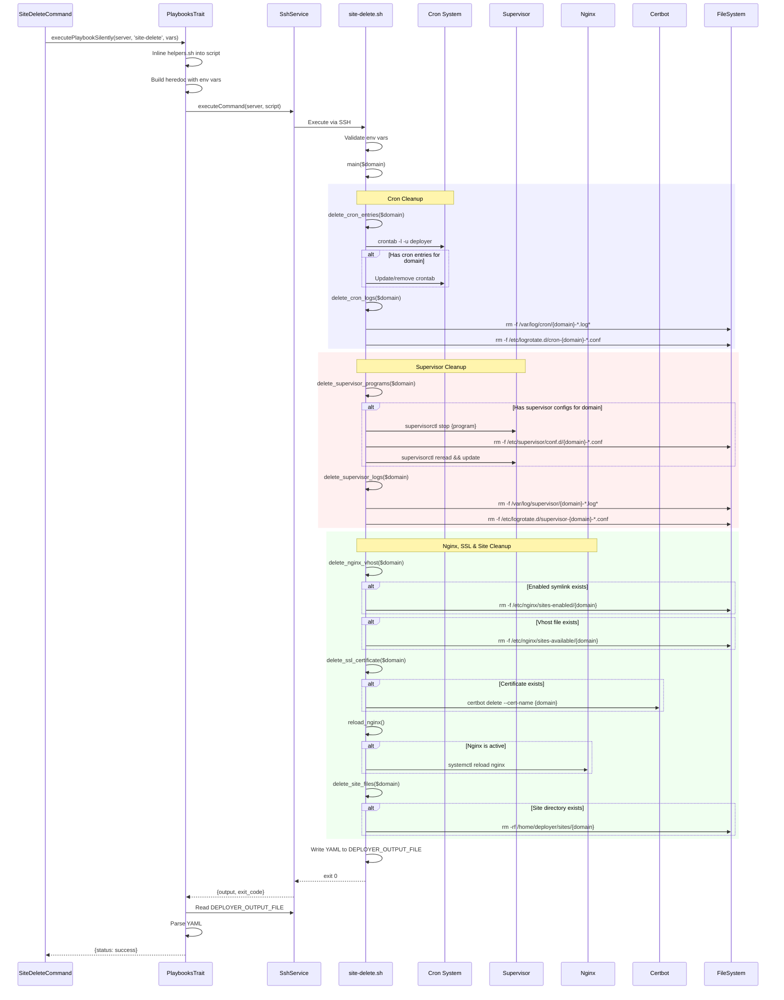

# Schematic: site-delete.sh

> Auto-generated schematic. Last updated: 2025-12-27

## Recent Changes

- **2025-12-27**: Migrated from Caddy to Nginx+Certbot. Renamed functions: `delete_caddy_vhost()` -> `delete_nginx_vhost()`, `reload_caddy()` -> `reload_nginx()`. Added `delete_ssl_certificate()` to revoke and clean up Let's Encrypt certificates via Certbot. Configuration paths changed from `/etc/caddy/conf.d/sites/{domain}.caddy` to `/etc/nginx/sites-available/{domain}` with symlink in `sites-enabled/`.

## Overview

Removes a site from a remote server by deleting cron entries, supervisor programs, Nginx vhost configuration, SSL certificates, and site directory, then reloads affected services. This playbook is executed remotely by `SiteDeleteCommand` through SSH, receiving the site domain via environment variables and returning YAML status output.

## Logic Flow

### Entry Points

| Function | Description |
|----------|-------------|
| `main()` | Primary entry point, orchestrates deletion sequence and output writing |

### Execution Flow

1. **Environment Validation** (lines 16-20)
   - Validates required environment variables: `DEPLOYER_OUTPUT_FILE`, `DEPLOYER_DISTRO`, `DEPLOYER_PERMS`, `DEPLOYER_SITE_DOMAIN`
   - Exits with error if any required variable is missing
   - Exports `DEPLOYER_PERMS` for use by helper functions

2. **Cron Entry Deletion** (lines 36-77)
   - `delete_cron_entries()` retrieves current crontab for deployer user
   - Checks for domain-specific markers (`# DEPLOYER-CRON-START {domain}` / `# DEPLOYER-CRON-END {domain}`)
   - Uses awk to remove lines between markers (inclusive)
   - Updates or removes crontab depending on remaining content

3. **Cron Log Cleanup** (lines 82-108)
   - `delete_cron_logs()` finds and removes cron log files in `/var/log/cron/`
   - Matches patterns: `{domain}-*.log`, `{domain}-*.log.[0-9]*`, `{domain}-*.log.*.gz`
   - Removes logrotate configs matching `cron-{domain}-*.conf`

4. **Supervisor Program Deletion** (lines 117-148)
   - `delete_supervisor_programs()` finds configs in `/etc/supervisor/conf.d/`
   - Stops each program via `supervisorctl stop`
   - Removes config files matching `{domain}-*.conf`
   - Reloads supervisor with `reread` and `update`

5. **Supervisor Log Cleanup** (lines 153-180)
   - `delete_supervisor_logs()` finds and removes log files in `/var/log/supervisor/`
   - Matches patterns: `{domain}-*.log`, `{domain}-*.log.[0-9]*`, `{domain}-*.log.*.gz`
   - Removes logrotate configs matching `supervisor-{domain}-*.conf`

6. **Nginx Vhost Deletion** (`delete_nginx_vhost()`)
   - Removes symlink at `/etc/nginx/sites-enabled/{domain}` first (disables site)
   - Removes vhost file at `/etc/nginx/sites-available/{domain}`
   - Exits with error if deletion fails

7. **SSL Certificate Deletion** (`delete_ssl_certificate()`)
   - Checks for certificates at `/etc/letsencrypt/live/{domain}` and `/etc/letsencrypt/live/www.{domain}`
   - Runs `certbot delete --cert-name {domain}` to revoke and clean up
   - Removes orphaned renewal configs from `/etc/letsencrypt/renewal/`

8. **Nginx Reload** (`reload_nginx()`)
   - Tests Nginx configuration with `nginx -t` before reload
   - Checks if Nginx service is active via `systemctl is-active`
   - If active, reloads Nginx with `run_cmd systemctl reload nginx`
   - Warns on failure (non-fatal)

9. **Site Files Deletion** (`delete_site_files()`)
   - `delete_site_files()` checks if `/home/deployer/sites/{domain}` exists
   - If directory exists, removes it recursively with `run_cmd rm -rf`
   - Exits with error if deletion fails

9. **Output Generation** (lines 256-261)
   - Writes YAML status to `DEPLOYER_OUTPUT_FILE`
   - Returns `status: success` on completion

### Decision Points

| Location | Condition | True Branch | False Branch |
|----------|-----------|-------------|--------------|
| Line 46 | Crontab is empty | Return early | Continue processing |
| Line 51 | Domain marker not found | Return early | Remove entries |
| Line 68-75 | Updated crontab non-empty | Write updated crontab | Remove crontab entirely |
| Line 89 | Cron log files found | Delete files | Skip |
| Line 101 | Cron logrotate configs found | Delete configs | Skip |
| Line 124 | Supervisor configs found | Stop and remove | Return early |
| Line 161 | Supervisor log files found | Delete files | Skip |
| Line 171 | Supervisor logrotate configs found | Delete configs | Skip |
| `delete_nginx_vhost()` | Nginx enabled symlink exists | Remove symlink | Skip |
| `delete_nginx_vhost()` | Nginx vhost file exists | Delete file | Skip |
| `delete_ssl_certificate()` | Certificate at `/etc/letsencrypt/live/{domain}` | Run certbot delete | Skip |
| `delete_ssl_certificate()` | Certificate at `/etc/letsencrypt/live/www.{domain}` | Run certbot delete | Skip |
| `reload_nginx()` | Nginx service is active | Reload service | Skip reload |
| `delete_site_files()` | Site directory exists | Delete directory | Skip |

### Exit Conditions

| Exit Code | Condition |
|-----------|-----------|
| 0 | All operations completed successfully, YAML output written |
| 1 | Missing required environment variable |
| 1 | Failed to update crontab |
| 1 | Failed to disable site (remove symlink) |
| 1 | Failed to delete Nginx configuration file |
| 1 | Failed to delete site directory |
| 1 | Failed to write output file |

## Interaction Diagram

## Dependencies

### Direct Imports

| File/Module | Usage |
|-------------|-------|
| `helpers.sh` | Provides `run_cmd()` for permission-aware command execution (auto-inlined by PHP) |

### Coupled Files

| File | Coupling Type | Description |
|------|---------------|-------------|
| `app/Console/Site/SiteDeleteCommand.php` | Command | Invokes playbook with `DEPLOYER_SITE_DOMAIN` |
| `app/Traits/PlaybooksTrait.php` | Execution | Handles SSH execution, env var injection, YAML parsing |
| `playbooks/site-create.sh` | Pattern | Complementary script that creates site directory and Nginx config |
| `playbooks/site-https.sh` | Pattern | Creates SSL certificates that this script removes |
| `playbooks/cron-sync.sh` | Pattern | Creates cron entries and logs that this script removes |
| `playbooks/supervisor-sync.sh` | Pattern | Creates supervisor configs and logs that this script removes |
| `/etc/nginx/sites-available/{domain}` | Config | Nginx vhost file created by `site-create.sh` |
| `/etc/nginx/sites-enabled/{domain}` | Config | Symlink to enable vhost created by `site-create.sh` |
| `/etc/letsencrypt/live/{domain}/` | Config | SSL certificate created by `site-https.sh` |
| `/etc/letsencrypt/renewal/{domain}.conf` | Config | Renewal config created by Certbot |
| `/home/deployer/sites/{domain}/` | Data | Site directory structure created by `site-create.sh` |
| `/var/log/cron/{domain}-*.log` | Log | Cron log files created by `cron-sync.sh` |
| `/etc/logrotate.d/cron-{domain}-*.conf` | Config | Cron logrotate configs created by `cron-sync.sh` |
| `/etc/supervisor/conf.d/{domain}-*.conf` | Config | Supervisor program configs created by `supervisor-sync.sh` |
| `/var/log/supervisor/{domain}-*.log` | Log | Supervisor log files |
| `/etc/logrotate.d/supervisor-{domain}-*.conf` | Config | Supervisor logrotate configs created by `supervisor-sync.sh` |

## Data Flow

### Inputs

| Variable | Source | Description |
|----------|--------|-------------|
| `DEPLOYER_OUTPUT_FILE` | PlaybooksTrait | Unique temp file path for YAML output |
| `DEPLOYER_DISTRO` | Server info | Distribution (ubuntu\|debian) - validated but not used |
| `DEPLOYER_PERMS` | Server info | Permission level (root\|sudo\|none) - used by `run_cmd` |
| `DEPLOYER_SITE_DOMAIN` | Command | Domain of the site to delete (e.g., `example.com`) |

### Outputs

| Output | Destination | Description |
|--------|-------------|-------------|
| YAML file | `$DEPLOYER_OUTPUT_FILE` | Contains `status: success` on completion |
| stdout | SSH stream | Progress messages (e.g., "Removing cron entries for...") |
| stderr | SSH stream | Error messages on failure |
| exit code | SSH result | 0 on success, 1 on any failure |

### Side Effects

| Effect | Description |
|--------|-------------|
| Cron entries removal | Removes domain-specific entries from deployer's crontab |
| Cron log removal | Deletes `/var/log/cron/{domain}-*.log*` including rotated files |
| Cron logrotate removal | Deletes `/etc/logrotate.d/cron-{domain}-*.conf` |
| Supervisor program stop | Stops all supervisor programs for the domain |
| Supervisor config removal | Deletes `/etc/supervisor/conf.d/{domain}-*.conf` |
| Supervisor reload | Reloads supervisor to unregister stopped programs |
| Supervisor log removal | Deletes `/var/log/supervisor/{domain}-*.log*` including rotated files |
| Supervisor logrotate removal | Deletes `/etc/logrotate.d/supervisor-{domain}-*.conf` |
| Nginx symlink removal | Removes `/etc/nginx/sites-enabled/{domain}` to disable site |
| Nginx vhost removal | Deletes `/etc/nginx/sites-available/{domain}` |
| SSL certificate removal | Runs `certbot delete` to revoke and remove certificates |
| SSL renewal config removal | Removes `/etc/letsencrypt/renewal/{domain}.conf` |
| Nginx service reload | Reloads Nginx to remove site from active configuration |
| Site directory removal | Recursively deletes `/home/deployer/sites/{domain}/` including all releases, shared files, and current symlink |
| Output file creation | Creates temp file at `$DEPLOYER_OUTPUT_FILE` (cleaned up by PlaybooksTrait) |

## Notes

- **Cleanup Order**: The script follows a deliberate order: crons -> supervisors -> nginx -> ssl -> site files. Crons and supervisors are stopped before web traffic stops, preventing execution failures. Nginx is reloaded before file deletion to prevent 500 errors.

- **Idempotency**: The playbook is idempotent - all operations check for existence before attempting deletion. Running against an already-deleted site succeeds silently.

- **Rotated Log Patterns**: Both cron and supervisor log cleanup handle rotated files with patterns `.log.[0-9]*` (numeric rotation) and `.log.*.gz` (compressed rotation).

- **Crontab Marker System**: Cron entries are wrapped in `# DEPLOYER-CRON-START {domain}` and `# DEPLOYER-CRON-END {domain}` markers, allowing surgical removal without affecting other domains or manually-added crons.

- **Supervisor Graceful Shutdown**: Programs are stopped individually before config removal, then supervisor is reloaded with `reread` and `update` to cleanly unregister the programs.

- **Nginx Config Test**: Before reloading Nginx, the playbook runs `nginx -t` to validate configuration. This prevents broken configs from crashing the web server.

- **Nginx Reload Skip**: If Nginx is not running (e.g., during server maintenance), the reload step is skipped. This prevents failures when the web server is intentionally stopped.

- **SSL Certificate Cleanup**: Certbot handles certificate revocation and file cleanup. The playbook checks both `{domain}` and `www.{domain}` certificate paths since the primary domain varies based on WWW mode.

- **Distribution Variable**: `DEPLOYER_DISTRO` is validated as required but not actually used in the script logic. This is for consistency with other playbooks and potential future use.

- **Helper Inlining**: The `run_cmd` function from `helpers.sh` is automatically inlined by `PlaybooksTrait::executePlaybook()` before remote execution. The commented source line serves as a marker for this injection point.

- **No Backup**: The playbook does not create backups before deletion. The calling command (`SiteDeleteCommand`) implements safety mechanisms (type-to-confirm, yes/no prompt) instead.
