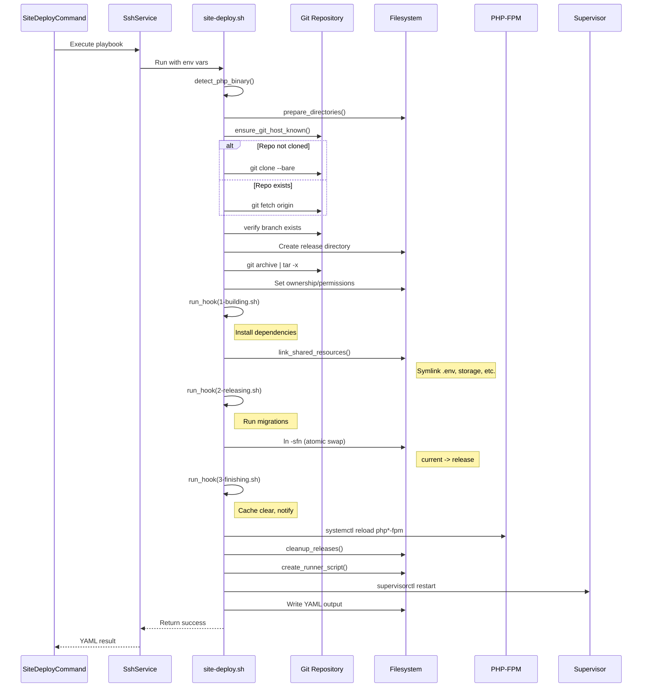
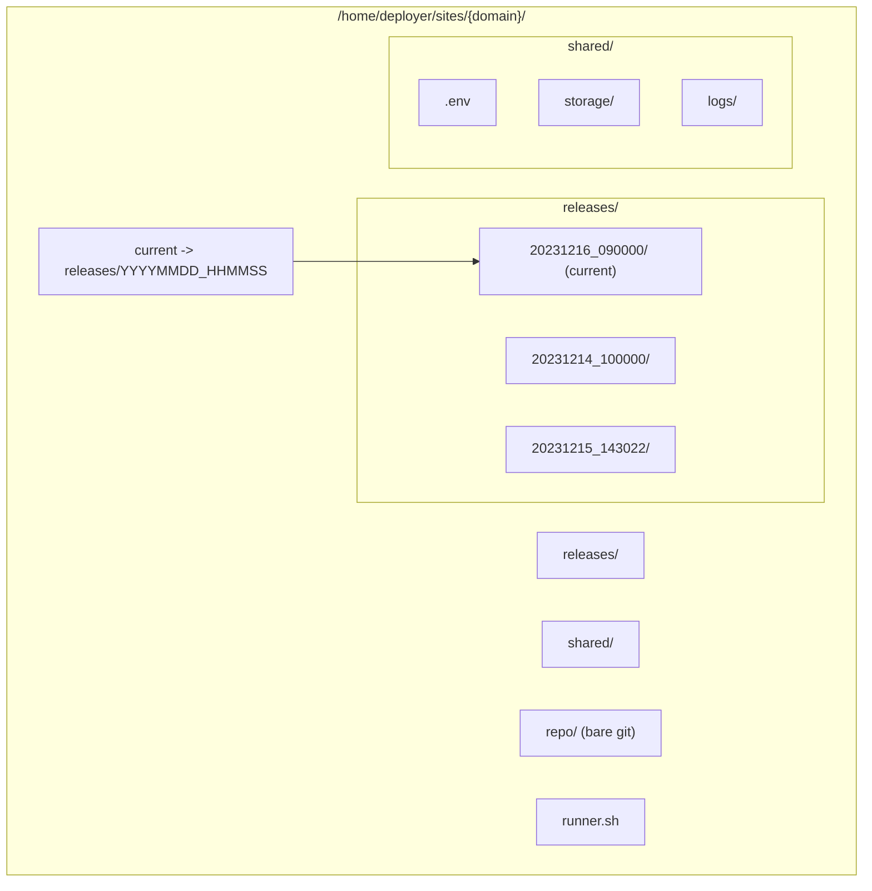

# Schematic: site-deploy.sh

> Auto-generated schematic. Last updated: 2025-12-18

## Overview

Atomic deployment playbook that deploys PHP sites using git-based releases with symlink swapping. Clones/updates a bare repository, creates timestamped releases, executes deployment hooks, links shared resources, swaps the `current` symlink, and performs cleanup including PHP-FPM reload and supervisor restarts.

## Logic Flow

### Entry Points

| Function | Purpose |
|----------|---------|
| `main()` | Orchestrates complete deployment process |

### Execution Flow

1. **Environment Validation** (lines 21-32)
   - Validates required `DEPLOYER_*` environment variables
   - Sets default `DEPLOYER_KEEP_RELEASES=5` if not provided
   - Exports `DEPLOYER_PERMS` for helper functions

2. **Path Setup** (lines 38-58)
   - Calculates site paths: `SITE_ROOT`, `RELEASE_PATH`, `SHARED_PATH`, `CURRENT_PATH`, `REPO_PATH`
   - Exports deployment context variables for hooks
   - Defines `PRESERVE_ENV_VARS` for sudo environment preservation

3. **PHP Detection** (lines 106-117)
   - `detect_php_binary()` locates versioned PHP binary
   - Falls back to default `php` if version-specific not found
   - Exports `DEPLOYER_PHP` for hook usage

4. **Directory Preparation** (lines 133-146)
   - `prepare_directories()` creates site structure
   - Creates `releases/`, `shared/`, `repo/` directories
   - Sets `deployer:deployer` ownership
   - Removes non-symlink `current` path if exists

5. **Repository Operations** (lines 158-214)
   - `ensure_git_host_known()` adds SSH host keys
   - `clone_or_update_repo()` clones bare repo or fetches updates
   - Updates remote URL with error handling
   - Verifies target branch exists

6. **Release Building** (lines 226-243)
   - `build_release()` creates timestamped release directory
   - Exports code from bare repo via `git archive`
   - Sets strict ownership and permissions

7. **Hook Sequence** (lines 429-451)
   - `run_hooks_sequence()` orchestrates deployment steps:
     - Clone/update repository
     - Build release
     - Run `1-building.sh` hook
     - Link shared resources
     - Run `2-releasing.sh` hook
     - Activate release (swap symlink)
     - Run `3-finishing.sh` hook
     - Reload PHP-FPM
     - Cleanup old releases
     - Create runner script
     - Restart supervisor programs

8. **Output Generation** (lines 408-421)
   - `write_output()` creates YAML output with deployment results
   - Includes error checking for write failures (exits with code 1)

### Decision Points

| Location | Condition | Branch |
|----------|-----------|--------|
| Lines 21-27 | Missing required env vars | Exit 1 with error |
| Lines 30-32 | Invalid `DEPLOYER_KEEP_RELEASES` | Reset to default 5 |
| Lines 78-80 | Hook file doesn't exist | Return 0 (skip) |
| Lines 82-85 | Hook not executable | Make executable |
| Lines 143-145 | `current` is file not symlink | Remove and recreate |
| Lines 161-165 | Repo URL format | Parse domain for known_hosts |
| Lines 197-209 | Bare repo exists | Fetch updates vs clone fresh |
| Lines 211-213 | Branch not found | Fail deployment |
| Lines 268-270 | Fewer releases than limit | Skip cleanup |
| Lines 302-304 | No supervisors configured | Skip restart |

### Exit Conditions

| Return Value | Condition |
|--------------|-----------|
| Exit 0 | Deployment completed, YAML output written |
| Exit 1 | Missing required environment variable |
| Exit 1 | `fail()` called from any step |
| Exit 1 | Hook execution failed |
| Exit 1 | Git clone/fetch failed |
| Exit 1 | Branch not found in repository |
| Exit 1 | Failed to update repository URL |
| Exit 1 | Failed to write output file |

## Interaction Diagram

```mermaid
flowchart TD
    subgraph Input["Environment Variables"]
        ENV_DOMAIN["DEPLOYER_SITE_DOMAIN"]
        ENV_REPO["DEPLOYER_SITE_REPO"]
        ENV_BRANCH["DEPLOYER_SITE_BRANCH"]
        ENV_PHP["DEPLOYER_PHP_VERSION"]
        ENV_KEEP["DEPLOYER_KEEP_RELEASES"]
        ENV_SUPERVISORS["DEPLOYER_SUPERVISORS"]
    end

    subgraph Main["main()"]
        detect_php["detect_php_binary()"]
        prepare_dirs["prepare_directories()"]
        hooks_seq["run_hooks_sequence()"]
        write_out["write_output()"]
    end

    subgraph HooksSequence["run_hooks_sequence()"]
        clone_repo["clone_or_update_repo()"]
        build["build_release()"]
        hook1["run_hook(1-building.sh)"]
        link_shared["link_shared_resources()"]
        hook2["run_hook(2-releasing.sh)"]
        activate["activate_release()"]
        hook3["run_hook(3-finishing.sh)"]
        reload_php["reload_php_fpm()"]
        cleanup["cleanup_releases()"]
        runner["create_runner_script()"]
        supervisors["restart_supervisor_programs()"]
    end

    subgraph Helpers["helpers.sh (inlined)"]
        run_cmd["run_cmd()"]
        run_as_deployer["run_as_deployer()"]
        fail_helper["fail()"]
        link_shared_helper["link_shared_resources()"]
    end

    ENV_DOMAIN --> Main
    ENV_REPO --> Main
    ENV_BRANCH --> Main
    ENV_PHP --> Main
    ENV_KEEP --> Main
    ENV_SUPERVISORS --> Main

    detect_php --> prepare_dirs
    prepare_dirs --> hooks_seq
    hooks_seq --> write_out

    clone_repo --> build
    build --> hook1
    hook1 --> link_shared
    link_shared --> hook2
    hook2 --> activate
    activate --> hook3
    hook3 --> reload_php
    reload_php --> cleanup
    cleanup --> runner
    runner --> supervisors

    Main --> Helpers
    HooksSequence --> Helpers
```



## Deployment Sequence



## Directory Structure



## Dependencies

### Direct Imports

| File/Class | Usage |
|------------|-------|
| `helpers.sh` | Inlined at runtime; provides `run_cmd()`, `run_as_deployer()`, `fail()`, `link_shared_resources()` |

### Coupled Files

| File | Coupling Type | Description |
|------|---------------|-------------|
| `app/Console/Site/SiteDeployCommand.php` | Command | PHP command that executes this playbook |
| `app/Traits/PlaybooksTrait.php` | Trait | Provides `executePlaybook()` method |
| `playbooks/helpers.sh` | Playbook | Helper functions inlined at execution |
| `.deployer/hooks/1-building.sh` | Hook | User hook: install dependencies |
| `.deployer/hooks/2-releasing.sh` | Hook | User hook: migrations, pre-activation |
| `.deployer/hooks/3-finishing.sh` | Hook | User hook: post-activation cleanup |
| `/home/deployer/sites/{domain}/shared/*` | State | Shared resources linked into releases |
| `/home/deployer/sites/{domain}/releases/` | State | Release directories managed by script |
| `/home/deployer/sites/{domain}/current` | State | Symlink to active release |
| `/home/deployer/sites/{domain}/repo` | State | Bare git repository |
| `/home/deployer/sites/{domain}/runner.sh` | State | Generated script for cron execution |
| `/home/deployer/.ssh/known_hosts` | Config | SSH known hosts for git operations |

### System Services

| Service | Interaction |
|---------|-------------|
| `php{version}-fpm` | Reloaded after release activation |
| `supervisor` | Programs restarted via `supervisorctl` |
| `git` | Repository operations via `git` commands |
| `ssh` | Host key management via `ssh-keyscan` |

## Data Flow

### Inputs

| Source | Data | Description |
|--------|------|-------------|
| `DEPLOYER_OUTPUT_FILE` | string | Path to write YAML output |
| `DEPLOYER_DISTRO` | string | Distribution: `ubuntu` or `debian` |
| `DEPLOYER_PERMS` | string | Permission mode: `root`, `sudo`, or `none` |
| `DEPLOYER_SITE_DOMAIN` | string | Site domain (e.g., `example.com`) |
| `DEPLOYER_SITE_REPO` | string | Git repository URL |
| `DEPLOYER_SITE_BRANCH` | string | Git branch to deploy |
| `DEPLOYER_PHP_VERSION` | string | PHP version (e.g., `8.3`) |
| `DEPLOYER_KEEP_RELEASES` | int | Number of releases to retain (default: 5) |
| `DEPLOYER_SUPERVISORS` | JSON | Array of supervisor programs to restart |

### Outputs

| Destination | Data | Description |
|-------------|------|-------------|
| `$DEPLOYER_OUTPUT_FILE` | YAML | Deployment result with status, paths, metadata |
| `/home/deployer/sites/{domain}/releases/{timestamp}/` | Directory | New release with deployed code |
| `/home/deployer/sites/{domain}/current` | Symlink | Updated to point to new release |
| `/home/deployer/sites/{domain}/runner.sh` | Script | Updated runner with new release paths |

### YAML Output Format

```yaml
status: success
domain: example.com
branch: main
release_name: 20231215_143022
release_path: /home/deployer/sites/example.com/releases/20231215_143022
current_path: /home/deployer/sites/example.com/current
keep_releases: 5
```

### Side Effects

| Effect | Location | Description |
|--------|----------|-------------|
| Directory Creation | Server | Creates `releases/`, `shared/`, `repo/` directories |
| Git Clone/Fetch | Server | Clones or updates bare repository |
| Release Creation | Server | Creates timestamped release directory |
| Code Export | Server | Extracts code from git archive |
| Shared Linking | Server | Symlinks shared resources into release |
| Symlink Swap | Server | Atomically updates `current` symlink |
| PHP-FPM Reload | Server | Reloads PHP-FPM to clear opcode cache |
| Supervisor Restart | Server | Restarts configured supervisor programs |
| Release Cleanup | Server | Removes old releases beyond retention limit |
| Runner Script | Server | Creates/updates `runner.sh` for cron jobs |
| Known Hosts | Server | Adds git host key if missing |

## Hook Execution Context

### Environment Variables Available in Hooks

| Variable | Description |
|----------|-------------|
| `DEPLOYER_RELEASE_PATH` | Path to current release being built |
| `DEPLOYER_SHARED_PATH` | Path to shared resources directory |
| `DEPLOYER_CURRENT_PATH` | Path to `current` symlink |
| `DEPLOYER_REPO_PATH` | Path to bare git repository |
| `DEPLOYER_DOMAIN` | Site domain |
| `DEPLOYER_BRANCH` | Git branch being deployed |
| `DEPLOYER_PHP_VERSION` | PHP version string |
| `DEPLOYER_PHP` | Full path to PHP binary |
| `DEPLOYER_KEEP_RELEASES` | Release retention count |
| `DEPLOYER_DISTRO` | Server distribution |
| `DEPLOYER_PERMS` | Permission mode |

### Hook Timing

| Hook | When | Purpose |
|------|------|---------|
| `1-building.sh` | After code export, before shared linking | Install dependencies (composer, npm) |
| `2-releasing.sh` | After shared linking, before activation | Run migrations, build assets |
| `3-finishing.sh` | After symlink activation | Clear caches, send notifications |

## Runner Script

The `runner.sh` script is generated for cron job execution with:

- Hard-coded environment variables
- Security validation (no absolute paths, no parent traversal)
- Path resolution within current release
- Automatic executable permission setting

Usage: `/home/deployer/sites/example.com/runner.sh relative/path/to/script.sh`

## Notes

### Atomic Deployment

The symlink swap (`ln -sfn`) is atomic on Linux, ensuring zero-downtime deployments. The old release remains accessible until the symlink is updated.

### Release Cleanup

Releases are sorted chronologically and older releases beyond `DEPLOYER_KEEP_RELEASES` are removed. The current release is never removed regardless of timestamp.

### Supervisor Restart Behavior

Supervisor program restarts are non-fatal - failures generate warnings but don't fail the deployment. This ensures deployment succeeds even if supervisor programs are temporarily misconfigured.

### Git Repository Strategy

Uses bare repository pattern:

- Initial clone: `git clone --bare $repo $repo_path`
- Updates: `git fetch origin '+refs/heads/*:refs/heads/*' --prune`
- Code export: `git archive $branch | tar -x`

This avoids working directory overhead and enables efficient incremental updates.

### Security Considerations

- `run_as_deployer()` preserves only whitelisted environment variables
- Runner script rejects absolute paths and parent traversal
- All user scripts are made executable before execution
- Ownership is explicitly set to `deployer:deployer`
