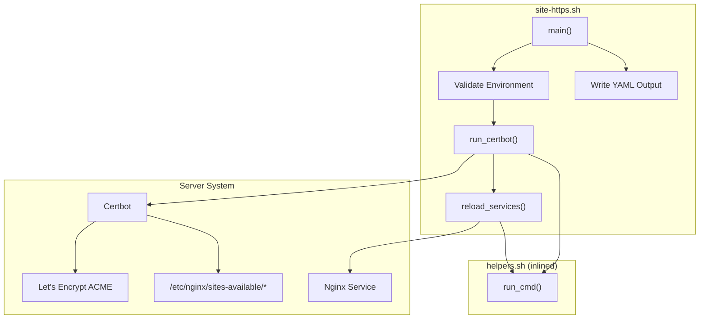
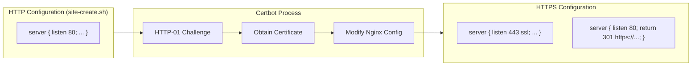

# Schematic: site-https.sh

> Auto-generated schematic. Last updated: 2025-12-27

## Recent Changes

- **2025-12-27**: Complete rewrite for Nginx+Certbot migration. Replaced Caddy's automatic HTTPS with explicit Certbot workflow: `request_certificate()` runs Certbot with Nginx plugin, `verify_certificate()` validates SSL installation, `ensure_renewal()` enables certbot.timer, and `reload_nginx()` applies configuration changes.

## Overview

Enables HTTPS for a site by running Certbot with the Nginx plugin to obtain a Let's Encrypt certificate. Certbot automatically modifies the Nginx configuration to add SSL support and HTTP-to-HTTPS redirects.

## Logic Flow

### Entry Points

| Function | Description |
|----------|-------------|
| `main()` | Primary entry point, orchestrates HTTPS enablement |

### Execution Flow

1. **Environment Validation** (lines 16-22)
   - Validates all required `DEPLOYER_*` environment variables
   - Exits with error if any required variable is missing
   - Exports `DEPLOYER_PERMS` for helper functions

2. **Certbot Execution** (`run_certbot()`)
   - Validates existing vhost file exists at `/etc/nginx/sites-available/{domain}`
   - Determines domains for certificate based on WWW mode:
     - `redirect-to-root`: Primary domain is root, includes www
     - `redirect-to-www`: Primary domain is www, includes root
   - Runs `certbot --nginx` with appropriate domain flags
   - Certbot automatically:
     - Performs HTTP-01 challenge
     - Obtains Let's Encrypt certificate
     - Modifies Nginx config for SSL
     - Adds HTTPS redirect

3. **Service Reload** (`reload_services()`)
   - Reloads Nginx to apply SSL configuration (if Certbot didn't already)

4. **Output Generation** (lines 136-142)
   - Writes YAML output with success status and `https_enabled: true`

### Decision Points

| Condition | True Branch | False Branch |
|-----------|-------------|--------------|
| Vhost file missing | Exit with error | Continue |
| WWW mode switch | Configure domains for certbot | Exit with error |
| Certbot fails | Exit with error | Continue |
| Nginx reload fails | Exit with error | Continue |

### Exit Conditions

| Exit Code | Condition |
|-----------|-----------|
| 0 | HTTPS enabled successfully, output written |
| 1 | Missing required environment variable |
| 1 | Vhost configuration file not found |
| 1 | Invalid WWW mode value |
| 1 | Certbot failed to obtain certificate |
| 1 | Failed to reload Nginx service |
| 1 | Failed to write output file |

## Interaction Diagram



## Configuration Transformation



## Dependencies

### Direct Imports

| File/Function | Usage |
|---------------|-------|
| `helpers.sh::run_cmd()` | Execute commands with appropriate permissions (root/sudo) |

### Coupled Files

| File | Coupling Type | Description |
|------|---------------|-------------|
| `site-create.sh` | Config | Creates initial HTTP vhost in `/etc/nginx/sites-available/` that Certbot modifies |
| `helpers.sh` | Code | Helper functions auto-inlined at runtime |
| `app/Console/Site/SiteHttpsCommand.php` | Command | PHP command that invokes this playbook |
| `/etc/nginx/sites-available/{domain}` | Remote Config | Nginx vhost file modified by Certbot for SSL |
| `/etc/letsencrypt/live/{domain}/` | Remote Config | Let's Encrypt certificate storage |
| `/etc/letsencrypt/renewal/{domain}.conf` | Remote Config | Certbot renewal configuration |

## Data Flow

### Inputs

| Source | Variable | Description |
|--------|----------|-------------|
| Environment | `DEPLOYER_OUTPUT_FILE` | Path for YAML output |
| Environment | `DEPLOYER_DISTRO` | Distribution (ubuntu/debian) |
| Environment | `DEPLOYER_PERMS` | Permission level (root/sudo/none) |
| Environment | `DEPLOYER_SITE_DOMAIN` | Domain name (e.g., example.com) |
| Environment | `DEPLOYER_WWW_MODE` | `redirect-to-root` or `redirect-to-www` |
| Filesystem | `/etc/nginx/sites-available/{domain}` | Existing HTTP vhost configuration |

### Outputs

| Destination | Data | Description |
|-------------|------|-------------|
| `$DEPLOYER_OUTPUT_FILE` | YAML | `status: success`, `https_enabled: true` |
| `/etc/nginx/sites-available/{domain}` | Nginx config | Modified by Certbot with SSL directives |
| `/etc/letsencrypt/live/{domain}/` | Certificates | fullchain.pem and privkey.pem |
| stdout | Progress messages | Action status with `->` prefix |
| stderr | Error messages | Failures with `Error:` prefix |

### Side Effects

| Effect | Description |
|--------|-------------|
| Config Modification | Certbot modifies Nginx vhost to add SSL configuration |
| Certificate Acquisition | Let's Encrypt HTTP-01 challenge validates domain ownership |
| Certificate Storage | Certificates stored in `/etc/letsencrypt/live/{domain}/` |
| Renewal Configuration | Creates `/etc/letsencrypt/renewal/{domain}.conf` |
| Timer Enable | Enables `certbot.timer` for automatic renewal |
| Service Reload | `systemctl reload nginx` applies SSL configuration |
| HTTP Redirect | Certbot adds redirect from HTTP to HTTPS |

## WWW Mode Certificate Domains

Certbot domain ordering affects the certificate's primary domain:

### redirect-to-root

```bash
# Root domain is primary, www redirects to root
certbot --nginx -d example.com -d www.example.com
```

### redirect-to-www

```bash
# WWW domain is primary, root redirects to www
certbot --nginx -d www.example.com -d example.com
```

## Notes

### Certbot Nginx Plugin

The `--nginx` plugin automatically:

1. Validates domain ownership via HTTP-01 challenge
2. Obtains certificate from Let's Encrypt
3. Modifies Nginx configuration to add SSL directives
4. Configures HTTP-to-HTTPS redirect
5. Sets up certificate paths in Nginx config

### Certbot Flags

| Flag | Purpose |
|------|---------|
| `--nginx` | Use Nginx plugin for automatic configuration |
| `--non-interactive` | No prompts, fail if input required |
| `--agree-tos` | Accept Let's Encrypt Terms of Service |
| `--redirect` | Add HTTP-to-HTTPS redirect |
| `--email` | Contact email for urgent notices |
| `--no-eff-email` | Don't share email with EFF |

### Certificate Verification

After Certbot runs, the playbook verifies:

1. Certificate files exist at `/etc/letsencrypt/live/{domain}/`
2. Certificate is valid and not expired (via `openssl x509 -checkend 0`)
3. Logs certificate expiry date

### Auto-Renewal

The playbook ensures `certbot.timer` is enabled and running:

- Timer runs twice daily to check for renewals
- Default renewal threshold: 30 days before expiry
- Certbot automatically reloads Nginx after renewal

### Prerequisites

- Site must exist in inventory (`site:create` executed)
- Vhost file must exist at `/etc/nginx/sites-available/{domain}`
- DNS A/AAAA records must point to server IP
- Port 80 must be open (for HTTP-01 challenge)
- Port 443 must be open (for HTTPS traffic)

### Idempotency

Running this playbook multiple times is safe:

- Certbot detects existing certificate and skips acquisition
- If certificate exists and is valid, Certbot exits early
- Nginx reload is idempotent
- Timer enable is idempotent

### Difference from site-create.sh

| Aspect | site-create.sh | site-https.sh |
|--------|----------------|---------------|
| Creates vhost | Yes | No (modifies) |
| SSL configuration | None | Added by Certbot |
| Redirects | HTTP only | HTTPS redirect added |
| Certificate | None | Let's Encrypt via Certbot |
| Listening ports | 80 only | 80 (redirect) + 443 (SSL) |
