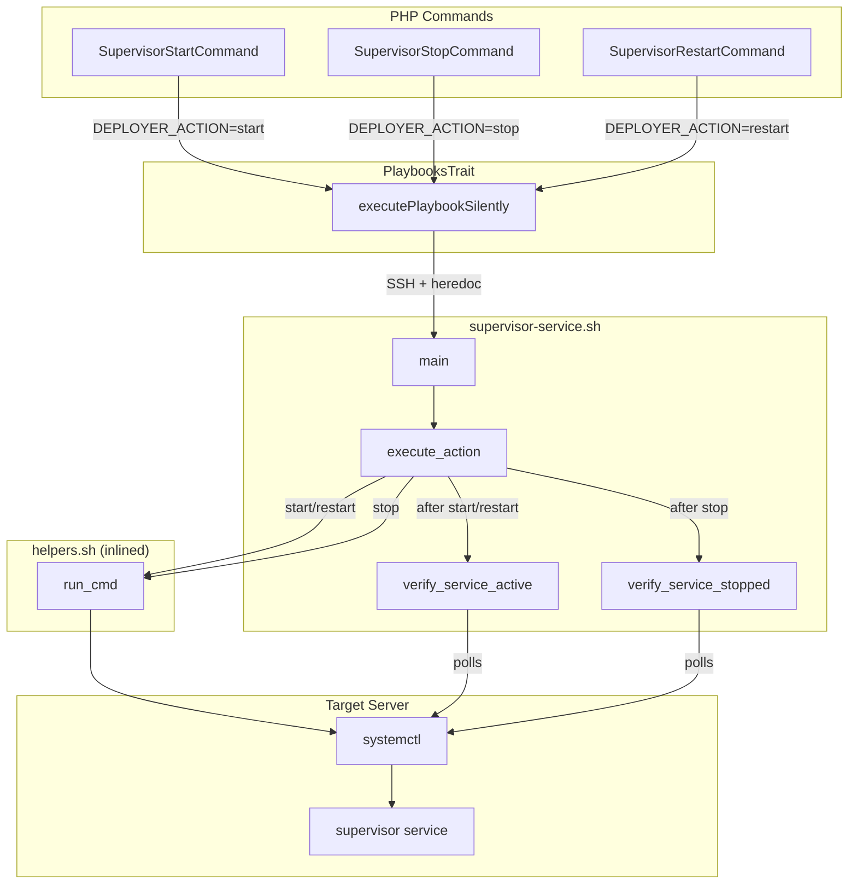
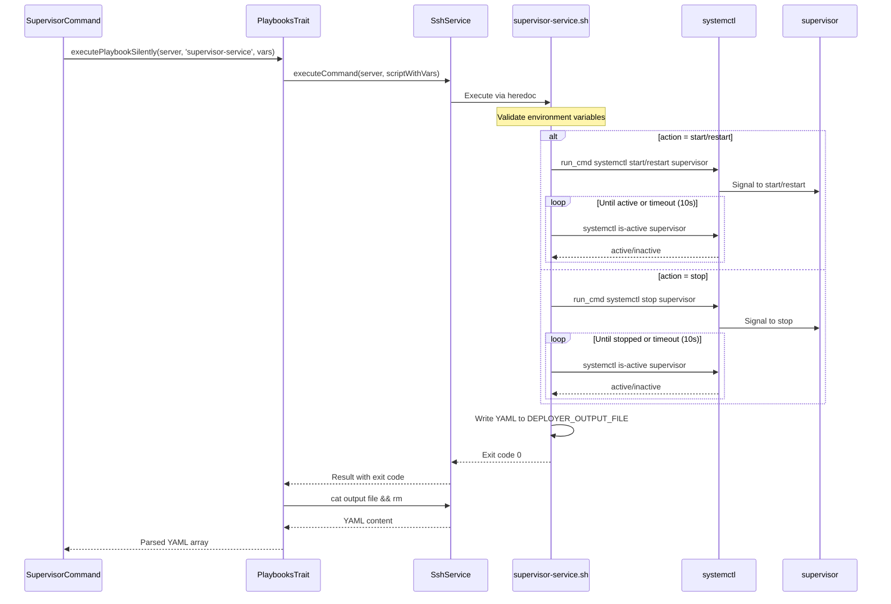

# Schematic: supervisor-service.sh

> Auto-generated schematic. Last updated: 2025-12-18

## Overview

Controls the supervisord service lifecycle (start/stop/restart) via systemctl on the remote server. This playbook is a simple service control wrapper that validates the requested action, executes the corresponding systemctl command, and verifies the service reaches the expected state.

## Logic Flow

### Entry Points

| Function | Purpose |
|----------|---------|
| `main()` | Script entry point, orchestrates action execution and output |

### Execution Flow

1. **Environment Validation** (lines 15-19)
   - Validates required environment variables: `DEPLOYER_OUTPUT_FILE`, `DEPLOYER_DISTRO`, `DEPLOYER_PERMS`, `DEPLOYER_ACTION`
   - Exports `DEPLOYER_PERMS` for use by helper functions

2. **Action Execution** (via `execute_action()`)
   - Routes to appropriate systemctl command based on `DEPLOYER_ACTION` value
   - For `start`/`restart`: Executes systemctl command, then verifies service is active
   - For `stop`: Executes systemctl stop, then verifies service is stopped
   - Invalid actions trigger error and exit

3. **Service Verification** (via `verify_service_active()` or `verify_service_stopped()`)
   - Polls `systemctl is-active` in a loop with 1-second intervals
   - Maximum wait time: 10 seconds
   - Fails with error if service does not reach expected state

4. **Output Generation** (in `main()`)
   - Writes YAML status to `DEPLOYER_OUTPUT_FILE`
   - Only returns `status: success` on successful completion

### Decision Points

| Line | Condition | True Branch | False Branch |
|------|-----------|-------------|--------------|
| 34-55 | `case $DEPLOYER_ACTION` | Routes to start/restart, stop, or error | N/A |
| 37 | `run_cmd systemctl start/restart` fails | Exit with error | Continue to verify |
| 45 | `run_cmd systemctl stop` fails | Exit with error | Continue to verify |
| 67 | Verification timeout exceeded | Exit with error | Continue polling |
| 85 | Verification timeout exceeded | Exit with error | Continue polling |

### Exit Conditions

| Exit Code | Condition | Location |
|-----------|-----------|----------|
| 1 | Missing `DEPLOYER_OUTPUT_FILE` | Line 15 |
| 1 | Missing `DEPLOYER_DISTRO` | Line 16 |
| 1 | Missing `DEPLOYER_PERMS` | Line 17 |
| 1 | Missing `DEPLOYER_ACTION` | Line 18 |
| 1 | Invalid action value | Line 53 |
| 1 | systemctl command fails | Lines 38, 46 |
| 1 | Service verification timeout | Lines 68, 86 |
| 1 | Failed to write output file | Line 104 |
| 0 | Successful completion | Implicit at script end |

## Interaction Diagram

## Dependencies

### Direct Imports

| File/Module | Usage |
|-------------|-------|
| `helpers.sh` | Inlined at runtime; provides `run_cmd()` for permission-aware command execution |

### Coupled Files

| File | Coupling Type | Description |
|------|---------------|-------------|
| `app/Console/Supervisor/SupervisorStartCommand.php` | Consumer | Invokes playbook with `DEPLOYER_ACTION=start` |
| `app/Console/Supervisor/SupervisorStopCommand.php` | Consumer | Invokes playbook with `DEPLOYER_ACTION=stop` |
| `app/Console/Supervisor/SupervisorRestartCommand.php` | Consumer | Invokes playbook with `DEPLOYER_ACTION=restart` |
| `app/Traits/PlaybooksTrait.php` | Executor | Handles SSH execution, environment injection, and YAML parsing |
| `/etc/systemd/system/` | System | Location of supervisor service unit file |
| `/tmp/deployer-output-*.yml` | Data | Temporary output file written by playbook |

## Data Flow

### Inputs

| Variable | Source | Description |
|----------|--------|-------------|
| `DEPLOYER_OUTPUT_FILE` | PlaybooksTrait | Path for YAML output file |
| `DEPLOYER_DISTRO` | Server info | Distribution: `ubuntu` or `debian` |
| `DEPLOYER_PERMS` | Server info | Permission level: `root`, `sudo`, or `none` |
| `DEPLOYER_ACTION` | Command | Action to perform: `start`, `stop`, or `restart` |

### Outputs

| Output | Format | Description |
|--------|--------|-------------|
| `DEPLOYER_OUTPUT_FILE` | YAML | Contains `status: success` on completion |
| stdout | Text | Progress messages prefixed with arrow |
| stderr | Text | Error messages on failure |

### Side Effects

| Effect | Description |
|--------|-------------|
| Service state change | Starts, stops, or restarts the supervisord systemd service |
| Process management | All supervisor-managed processes are affected by service state |

## Sequence Diagram

## Notes

### Design Characteristics

- **Simplicity**: Single-purpose script with minimal logic - just routes action to systemctl
- **Verification**: Includes polling loop to ensure service reaches expected state before returning success
- **Timeout Safety**: 10-second maximum wait prevents infinite loops on service issues

### Potential Issues

- **Hardcoded timeout**: The 10-second verification timeout may be insufficient on heavily loaded servers
- **No graceful degradation**: If verification fails, the action may have actually succeeded but just took longer than expected
- **Service name hardcoded**: Always uses `supervisor` as the service name (standard on Ubuntu/Debian)

### Usage Patterns

All three supervisor service commands follow identical patterns:

1. Select server with `selectServerDeets()`
2. Call `executePlaybookSilently()` with appropriate `DEPLOYER_ACTION`
3. Display success/failure message
4. Show command replay

### Helper Function Usage

- `run_cmd`: Used for systemctl commands to handle root vs sudo execution based on `DEPLOYER_PERMS`
- Note: `systemctl is-active` verification runs without `run_cmd` as it only reads state
