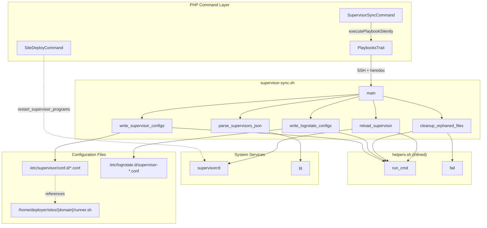
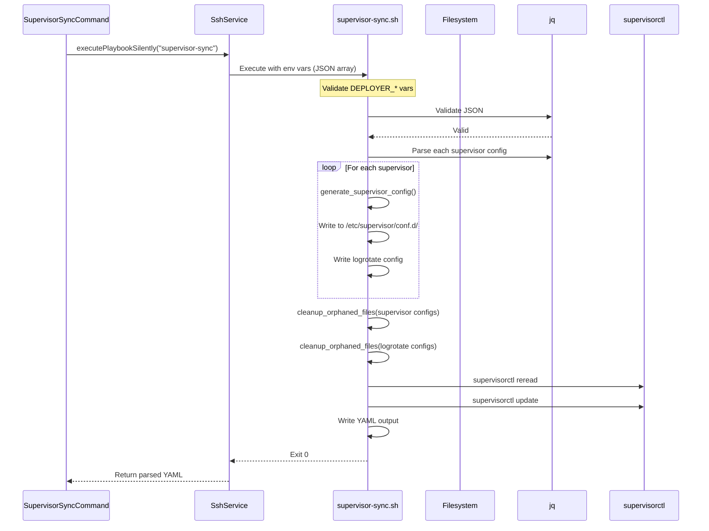

# Schematic: supervisor-sync.sh

> Auto-generated schematic. Last updated: 2025-12-19

## Overview

Synchronizes supervisor program configurations from the Deployer inventory to the server. Generates supervisor config files, corresponding logrotate configs, removes orphaned configs for deleted programs, and reloads supervisor to apply changes. Uses the existing `runner.sh` created during site deployment.

## Logic Flow

### Entry Points

| Function | Purpose |
|----------|---------|
| `main()` | Primary entry point, orchestrates sync tasks |

### Execution Flow

1. **Environment Validation** (lines 16-21)
   - Validates required environment variables: `DEPLOYER_OUTPUT_FILE`, `DEPLOYER_DISTRO`, `DEPLOYER_PERMS`, `DEPLOYER_SITE_DOMAIN`, `DEPLOYER_SUPERVISORS`
   - Exports `DEPLOYER_PERMS` for use by helper functions

2. **Path Configuration** (lines 26-30)
   - Sets `SITE_ROOT` to `/home/deployer/sites/${DEPLOYER_SITE_DOMAIN}`
   - Sets `CURRENT_PATH` to `${SITE_ROOT}/current`
   - Sets `RUNNER_PATH` to `${SITE_ROOT}/runner.sh`
   - Sets `CONF_DIR` to `/etc/supervisor/conf.d`
   - Sets `LOGROTATE_DIR` to `/etc/logrotate.d`

3. **JSON Parsing** (`parse_supervisors_json()`, lines 41-58)
   - Validates `DEPLOYER_SUPERVISORS` JSON using `jq`
   - Counts supervisors and stores in `SUPERVISOR_COUNT`
   - Builds `PROGRAM_NAMES` array with prefixed names (e.g., `example.com-queue-worker`)

4. **Supervisor Config Generation** (`write_supervisor_configs()`, lines 106-138)
   - Iterates through each supervisor in JSON array
   - Extracts: `program`, `script`, `autostart`, `autorestart`, `stopwaitsecs`, `numprocs`
   - Generates config content via `generate_supervisor_config()`
   - Writes config to `/etc/supervisor/conf.d/${domain}-${program}.conf`

5. **Logrotate Config Generation** (`write_logrotate_configs()`, lines 143-171)
   - Creates logrotate config for each program
   - Writes to `/etc/logrotate.d/supervisor-${domain}-${program}.conf`
   - Configures: daily rotation, 5 copies, 30-day max age, compression

6. **Orphan Cleanup** (`cleanup_orphaned_files()`, lines 182-222)
   - Finds existing config files matching pattern
   - Compares against current `PROGRAM_NAMES` array
   - Removes files for programs no longer in inventory
   - Called twice: once for supervisor configs, once for logrotate configs

7. **Supervisor Reload** (`reload_supervisor()`, lines 231-243)
   - Runs `supervisorctl reread` to detect config changes
   - Runs `supervisorctl update` to apply changes

8. **Output Generation** (`write_output()`, lines 252-260)
   - Writes YAML with `status: success` and `supervisors_synced` count

### Decision Points

| Location | Condition | True Branch | False Branch |
|----------|-----------|-------------|--------------|
| Line 42-45 | JSON invalid | Exit with error | Continue |
| Line 107-110 | `SUPERVISOR_COUNT == 0` | Return early, no work | Generate configs |
| Line 144-146 | `SUPERVISOR_COUNT == 0` | Return early | Generate logrotate |
| Line 193-195 | No existing files | Return early | Check for orphans |
| Line 210-215 | Program name in array | Keep file | Mark as orphan |
| Line 217-219 | Is orphan | Remove file | Skip |

### Exit Conditions

| Condition | Exit Code | Message |
|-----------|-----------|---------|
| Missing `DEPLOYER_OUTPUT_FILE` | 1 | "Error: DEPLOYER_OUTPUT_FILE required" |
| Missing `DEPLOYER_DISTRO` | 1 | "Error: DEPLOYER_DISTRO required" |
| Missing `DEPLOYER_PERMS` | 1 | "Error: DEPLOYER_PERMS required" |
| Missing `DEPLOYER_SITE_DOMAIN` | 1 | "Error: DEPLOYER_SITE_DOMAIN required" |
| Missing `DEPLOYER_SUPERVISORS` | 1 | "Error: DEPLOYER_SUPERVISORS required" |
| Invalid JSON | 1 | "Error: Invalid DEPLOYER_SUPERVISORS JSON" |
| Config write fails | 1 | "Error: Failed to write ${config_file}" |
| Logrotate write fails | 1 | "Error: Failed to write ${logrotate_file}" |
| Orphan removal fails | 1 | "Failed to remove ${file_path}" (via `fail()`) |
| Supervisor reread fails | 1 | "Error: Failed to reread supervisor configs" |
| Supervisor update fails | 1 | "Error: Failed to update supervisor" |
| Output write fails | 1 | "Error: Failed to write output file" |
| Success | 0 | YAML output with `status: success` |

## Interaction Diagram



## Sequence Diagram



## Dependencies

### Direct Imports

| File/Module | Usage |
|-------------|-------|
| `helpers.sh` | Inlined at runtime by `PlaybooksTrait` - provides `run_cmd`, `fail` |

### Coupled Files

| File | Coupling Type | Description |
|------|---------------|-------------|
| `app/Console/Supervisor/SupervisorSyncCommand.php` | Execution | Primary invoker, builds `DEPLOYER_SUPERVISORS` JSON from `SupervisorDTO` array |
| `app/Traits/PlaybooksTrait.php` | Execution | Handles SSH execution, helper inlining, JSON encoding, and YAML parsing |
| `playbooks/helpers.sh` | Code | Helper functions (`run_cmd`, `fail`) inlined before execution |
| `playbooks/site-deploy.sh` | Related | Has `restart_supervisor_programs()` that restarts programs after deployment |
| `app/DTOs/SupervisorDTO.php` | Data | Defines supervisor structure: program, script, autostart, autorestart, stopwaitsecs, numprocs |
| `playbooks/base-install.sh` | Prerequisite | Installs supervisor package |
| `/home/deployer/sites/{domain}/runner.sh` | Runtime | Script wrapper executed by supervisor programs |
| `/home/deployer/sites/{domain}/current/.deployer/supervisors/` | Runtime | Location of user supervisor scripts |

## Data Flow

### Inputs

| Variable | Type | Source | Description |
|----------|------|--------|-------------|
| `DEPLOYER_OUTPUT_FILE` | string | PlaybooksTrait | Path for YAML output file |
| `DEPLOYER_DISTRO` | string | ServerDTO.info | Distribution: `ubuntu` or `debian` |
| `DEPLOYER_PERMS` | string | ServerDTO.info | Permission level: `root`, `sudo`, or `none` |
| `DEPLOYER_SITE_DOMAIN` | string | SiteDTO.domain | Site domain for namespacing |
| `DEPLOYER_SUPERVISORS` | JSON | SupervisorSyncCommand | Array of supervisor configurations |

### DEPLOYER_SUPERVISORS JSON Structure

```json
[
  {
    "program": "queue-worker",
    "script": "queue-worker.sh",
    "autostart": true,
    "autorestart": true,
    "stopwaitsecs": 3600,
    "numprocs": 1
  }
]
```

### Outputs

| Field | Type | Description |
|-------|------|-------------|
| `status` | string | Always `success` on completion |
| `supervisors_synced` | int | Number of supervisor programs configured |

### Side Effects

| Effect | Location | Description |
|--------|----------|-------------|
| Config Creation | `/etc/supervisor/conf.d/${domain}-${program}.conf` | Supervisor program config files |
| Config Creation | `/etc/logrotate.d/supervisor-${domain}-${program}.conf` | Per-program log rotation configs |
| Config Deletion | `/etc/supervisor/conf.d/` | Orphaned configs removed |
| Config Deletion | `/etc/logrotate.d/` | Orphaned logrotate configs removed |
| Service Control | supervisorctl | Reread and update to apply config changes |
| Log Files | `/var/log/supervisor/${domain}-${program}.log` | Referenced in configs (stdout + stderr) |

## Generated Config Formats

### Supervisor Config

```ini
[program:example.com-queue-worker]
command=/home/deployer/sites/example.com/runner.sh .deployer/supervisors/queue-worker.sh
directory=/home/deployer/sites/example.com/current
user=deployer
autostart=true
autorestart=true
stopwaitsecs=3600
numprocs=1
stdout_logfile=/var/log/supervisor/example.com-queue-worker.log
stderr_logfile=/var/log/supervisor/example.com-queue-worker.log
```

### Logrotate Config

```
/var/log/supervisor/example.com-queue-worker.log {
    daily
    rotate 5
    maxage 30
    missingok
    notifempty
    compress
    delaycompress
    copytruncate
}
```

## Notes

### runner.sh Dependency

This playbook requires `runner.sh` to exist at `/home/deployer/sites/{domain}/runner.sh`. This file is created by `site-deploy.sh` and provides:

- Hard-coded environment variables for the current release
- Security validation (no absolute paths, no `..` traversal)
- Path resolution within current release only
- Automatic chmod +x before execution
- PHP binary path configured during deployment

### Idempotency

The playbook is designed to be idempotent:

- Config files are overwritten with current state
- Orphan cleanup removes configs for deleted programs
- `supervisorctl update` only restarts programs with changed configs

### Program Naming Convention

All supervisor programs are prefixed with the site domain to prevent conflicts:

- Inventory program: `queue-worker`
- System program: `example.com-queue-worker`
- Config file: `/etc/supervisor/conf.d/example.com-queue-worker.conf`

### runner.sh Integration

Supervisor programs execute via the site's `runner.sh` wrapper, which:

- Sets correct working directory (`/home/deployer/sites/{domain}/current`)
- Ensures proper environment variables
- Enables relative paths in user scripts
- Provides PHP binary path configured during deployment

The playbook requires `runner.sh` to exist before syncing. Deploy the site first to create this file.

### Relationship with site-deploy.sh

This playbook syncs configs but does not restart programs. `site-deploy.sh` has a separate `restart_supervisor_programs()` function that:

- Parses the same `DEPLOYER_SUPERVISORS` JSON
- Restarts each program via `supervisorctl restart`
- Runs after deployment to pick up code changes

### Orphan Cleanup Pattern

The `cleanup_orphaned_files()` function is generic and reusable:

- Accepts: directory, file pattern, prefix to strip, label for messages
- Compares found files against `PROGRAM_NAMES` array
- Used for both supervisor configs and logrotate configs
