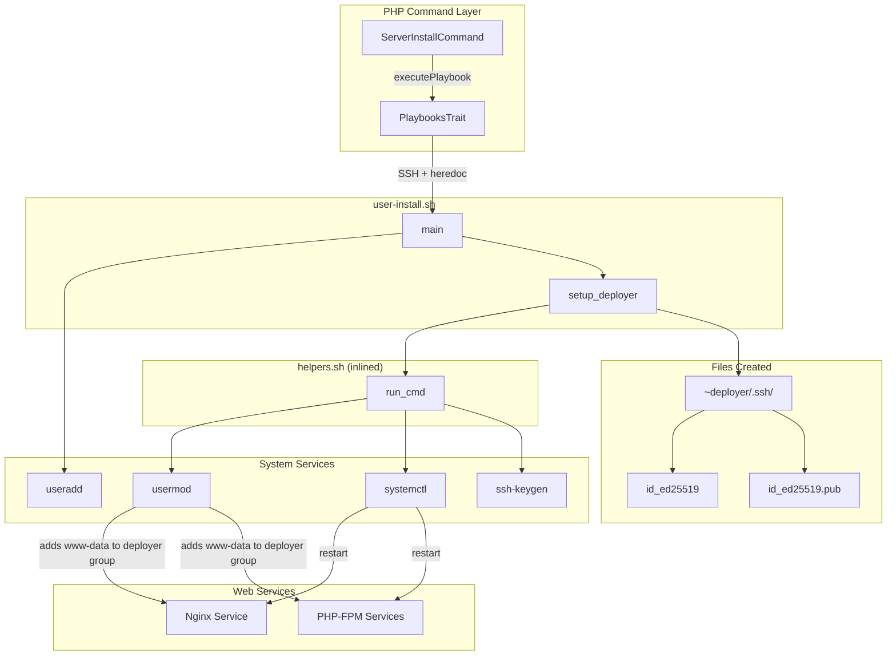
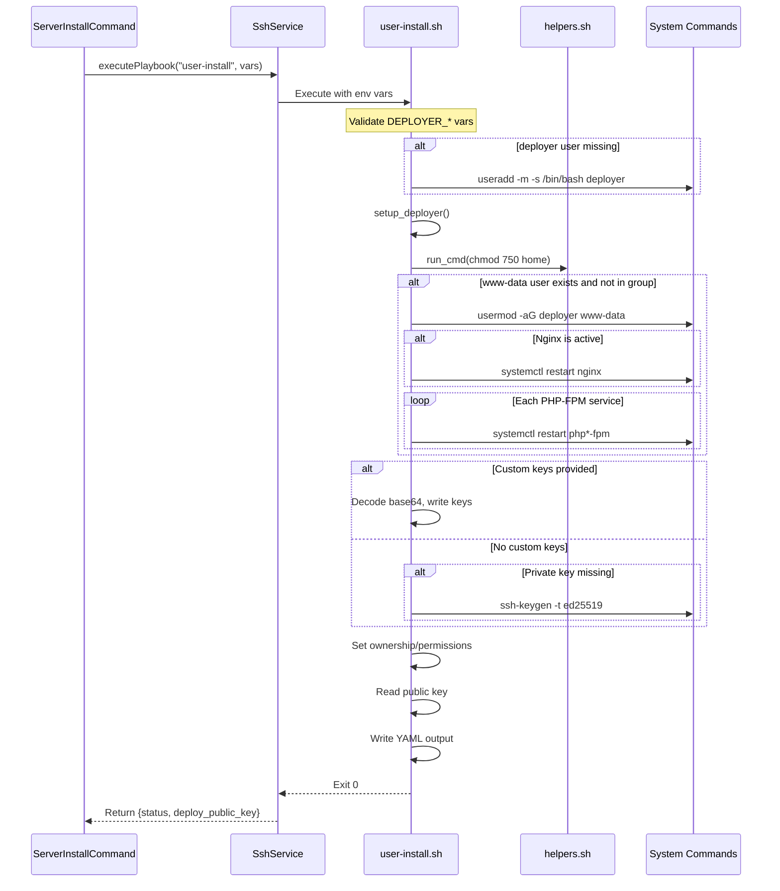

# Schematic: user-install.sh

> Auto-generated schematic. Last updated: 2025-12-27

## Recent Changes

- **2025-12-27**: Migrated from Caddy to Nginx. Removed Caddy group membership configuration. Now only adds `www-data` user to `deployer` group (for both Nginx and PHP-FPM access). Service restarts changed from Caddy to Nginx.

## Overview

`user-install.sh` creates and configures the `deployer` user account for PHP application deployments. It sets up home directory permissions, configures group memberships for web server access (Nginx via www-data, PHP-FPM), and generates or installs SSH deploy keys for Git repository authentication.

## Logic Flow

### Entry Points

| Function | Purpose |
|----------|---------|
| `main()` | Primary entry point, creates user and orchestrates setup |
| `setup_deployer()` | Configures permissions, groups, and SSH keys |

### Execution Flow

1. **Environment Validation** (lines 16-20)
   - Validates required environment variables: `DEPLOYER_OUTPUT_FILE`, `DEPLOYER_DISTRO`, `DEPLOYER_PERMS`, `DEPLOYER_SERVER_NAME`
   - Exports `DEPLOYER_PERMS` for use by helper functions

2. **User Creation** (`main()`, lines 156-162)
   - Checks if `deployer` user exists via `id -u`
   - Creates user with `useradd -m -s /bin/bash deployer` if missing

3. **Home Directory Discovery** (lines 164-169)
   - Retrieves home directory path from `/etc/passwd` via `getent`
   - Validates discovery succeeded

4. **Setup Deployer** (`setup_deployer()`)
   - Sets home directory permissions to 750

5. **Group Membership Configuration**
   - Adds `www-data` user to `deployer` group (if www-data exists and not already in group)
   - Restarts Nginx service to apply group membership
   - Restarts all active PHP-FPM services to apply group membership

6. **SSH Key Setup** (lines 92-144)
   - Creates `.ssh` directory if missing
   - If `DEPLOYER_KEY_PRIVATE` and `DEPLOYER_KEY_PUBLIC` provided:
     - Decodes base64 and writes custom key pair
   - Otherwise:
     - Generates ed25519 key pair with `deployer@{server-name}` comment
   - Sets ownership to `deployer:deployer`
   - Sets directory permissions (700) and file permissions (600/644)

7. **Output Generation** (lines 173-184)
   - Reads public key from `~/.ssh/id_ed25519.pub`
   - Writes YAML output with `status: success` and `deploy_public_key`

### Decision Points

| Condition | True Branch | False Branch |
|-----------|-------------|--------------|
| `www-data` user exists | Check/add to deployer group | Skip |
| `www-data` not in deployer group | Add to group, restart Nginx and PHP-FPM | Skip |
| Nginx service active | Restart Nginx | Skip |
| PHP-FPM services active | Restart each service | Skip |
| `.ssh` directory missing | Create directory | Skip |
| Custom keys provided | Install custom keys | Generate new keys |
| Private key missing | Generate new key pair | Skip |
| `deployer` user missing | Create user | Skip |

### Exit Conditions

| Condition | Exit Code | Message |
|-----------|-----------|---------|
| Missing `DEPLOYER_OUTPUT_FILE` | 1 | "Error: DEPLOYER_OUTPUT_FILE required" |
| Missing `DEPLOYER_DISTRO` | 1 | "Error: DEPLOYER_DISTRO required" |
| Missing `DEPLOYER_PERMS` | 1 | "Error: DEPLOYER_PERMS required" |
| Missing `DEPLOYER_SERVER_NAME` | 1 | "Error: DEPLOYER_SERVER_NAME required" |
| User creation fails | 1 | "Error: Failed to create deployer user" |
| Home directory not found | 1 | "Error: Unable to determine deployer home directory" |
| Home chmod fails | 1 | "Error: Failed to set permissions on deployer home directory" |
| Group add fails | 1 | "Error: Failed to add www-data to deployer group" |
| Nginx restart fails | N/A | Warning only (non-fatal) |
| SSH directory creation fails | 1 | "Error: Failed to create .ssh directory" |
| Private key write fails | 1 | "Error: Failed to write private key" |
| Public key write fails | 1 | "Error: Failed to write public key" |
| Key generation fails | 1 | "Error: Failed to generate SSH key pair" |
| Ownership change fails | 1 | "Error: Failed to set ownership on .ssh directory" |
| Permission change fails | 1 | "Error: Failed to set permissions on .ssh directory/keys" |
| Public key read fails | 1 | "Error: Failed to read deploy public key" |
| Output file write fails | 1 | "Error: Failed to write output file" |
| Success | 0 | YAML output with `status: success` and `deploy_public_key` |

## Interaction Diagram



## Sequence Diagram



## Dependencies

### Direct Imports

| File/Module | Usage |
|-------------|-------|
| `helpers.sh` | Inlined at runtime by `PlaybooksTrait` - provides `run_cmd` |

### Coupled Files

| File | Coupling Type | Description |
|------|---------------|-------------|
| `app/Console/Server/ServerInstallCommand.php` | Execution | Invokes this playbook, passes optional custom key pair via `DEPLOYER_KEY_PRIVATE`/`DEPLOYER_KEY_PUBLIC` |
| `app/Traits/PlaybooksTrait.php` | Execution | Handles SSH execution, helper inlining, and YAML parsing |
| `playbooks/helpers.sh` | Code | Helper functions inlined before execution |
| `playbooks/base-install.sh` | Prerequisite | Must run first to install Nginx (for group membership) |
| `playbooks/php-install.sh` | Prerequisite | Should run before to have PHP-FPM services (for group membership) |

## Data Flow

### Inputs

| Variable | Type | Source | Description |
|----------|------|--------|-------------|
| `DEPLOYER_OUTPUT_FILE` | string | PlaybooksTrait | Path for YAML output file |
| `DEPLOYER_DISTRO` | string | ServerDTO.info | Distribution: `ubuntu` or `debian` |
| `DEPLOYER_PERMS` | string | ServerDTO.info | Permission level: `root`, `sudo`, or `none` |
| `DEPLOYER_SERVER_NAME` | string | ServerDTO | Server name for SSH key comment |
| `DEPLOYER_KEY_PRIVATE` | string (optional) | ServerInstallCommand | Base64-encoded custom private key |
| `DEPLOYER_KEY_PUBLIC` | string (optional) | ServerInstallCommand | Base64-encoded custom public key |

### Outputs

| Field | Type | Description |
|-------|------|-------------|
| `status` | string | Always `success` on completion |
| `deploy_public_key` | string | SSH public key (e.g., `ssh-ed25519 AAAA... deployer@server-name`) |

### Side Effects

| Effect | Location | Description |
|--------|----------|-------------|
| User Creation | `/etc/passwd` | Creates `deployer` user with home directory |
| Directory Permissions | `~deployer/` | Sets home directory to 750 |
| Group Membership | `/etc/group` | Adds `www-data` to `deployer` group |
| Service Restart | Nginx | Restarts Nginx to apply group membership |
| Service Restart | PHP-FPM | Restarts all active PHP-FPM services |
| Directory Creation | `~deployer/.ssh/` | Creates SSH directory with 700 permissions |
| Key File | `~deployer/.ssh/id_ed25519` | Private key with 600 permissions |
| Key File | `~deployer/.ssh/id_ed25519.pub` | Public key with 644 permissions |

## Notes

### Idempotency

The playbook is designed to be idempotent:

- User creation checks if user exists before creating (line 156)
- Group membership checks if www-data already in deployer group
- SSH directory creation checks for existence (line 96)
- Key generation only runs if private key missing (line 117)
- Custom key installation always overwrites (intentional - allows key rotation)

### Group Membership Purpose

Web services need read access to deployer-owned files:

- **Nginx (via www-data)**: Serves static files from site directories
- **PHP-FPM (via www-data)**: Executes PHP scripts in site directories

Adding `www-data` to the `deployer` group with 750 home directory permissions enables access without world-readable files. Both Nginx and PHP-FPM run as `www-data` user on Debian/Ubuntu systems.

### SSH Key Types

The playbook generates ed25519 keys for:

- Better security than RSA
- Shorter key length (easier to copy/paste)
- Faster operations

### Custom Key Flow

When `--custom-deploy-key` is provided to `server:install`:

1. Command reads private key and `{path}.pub` public key
2. Base64 encodes both for safe transmission
3. Playbook decodes and writes to `~deployer/.ssh/`

This allows using existing SSH keys for Git authentication across multiple servers.

### Execution Order

Within `server:install`, this playbook runs last:

1. `package-list` - Gathers available packages
2. `base-install` - Installs core infrastructure (Nginx)
3. `php-install` - Installs PHP and extensions (PHP-FPM)
4. `bun-install` - Installs Bun JavaScript runtime
5. **`user-install`** - Sets up deployer user and keys

This order ensures Nginx and PHP-FPM are installed before configuring their group memberships.

### PHP-FPM Restart Discovery

The playbook dynamically discovers active PHP-FPM services:

```bash
systemctl list-units --type=service --state=active 'php*-fpm.service' --no-legend
```

This handles multiple PHP versions installed simultaneously (e.g., php8.3-fpm and php8.4-fpm).
