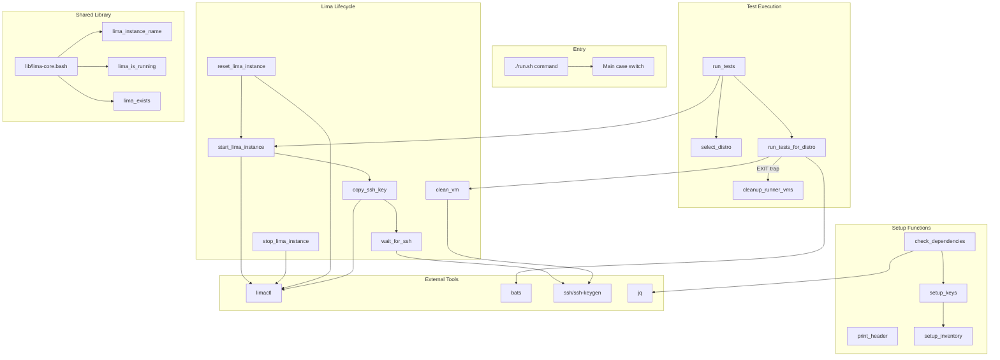

# Schematic: run.sh

> Auto-generated schematic. Last updated: 2025-12-22

## Overview

`run.sh` is the BATS (Bash Automated Testing System) test runner for the Deployer project. It orchestrates Lima VM lifecycle management and test execution across multiple Linux distributions. The script provides commands for running tests, starting/stopping VMs, resetting VM state, and SSH access to test VMs.

## Logic Flow

### Entry Points

| Command | Purpose | Arguments |
|---------|---------|-----------|
| `run [filter]` | Run tests with optional filter | Test file name (e.g., `server`) |
| `start [distro]` | Start VMs | Optional distro name |
| `stop [distro]` | Stop VMs | Optional distro name |
| `reset [distro]` | Factory reset VMs | Optional distro name |
| `clean [distro]` | Clean VM state without restart | Optional distro name |
| `ssh <distro>` | SSH into a test VM | Required distro name |
| `help` | Show usage information | None |

### Execution Flow

#### Test Run Flow (`run`)

```
1. Validate dependencies (bats, lima, jq)
2. Setup SSH keys (generate if missing)
3. Setup empty test inventory
4. Interactive distro selection (single or all)
5. Set EXIT trap for VM cleanup
6. Start selected VM(s)
7. Wait for SSH availability
8. For each distro:
   a. Clean VM state via SSH
   b. Print distro header
   c. Export BATS_DISTRO environment variable
   d. Execute bats on test files
9. Return aggregate exit code
```

#### VM Start Flow (`start_lima_instance`)

```
1. Get instance name from distro (deployer-test-{distro})
2. Stop and delete any existing VM (clean slate)
3. Create VM from lima/{distro}.yaml config
4. Copy SSH public key to VM for root/deployer access
5. Wait for SSH to become available
```

#### VM Clean Flow (`clean_vm`)

```
1. SSH into VM as root
2. Remove /home/deployer/sites/*
3. Stop caddy service, remove site configs
4. Remove supervisor deployer-* configs, reread
5. Remove crontab
```

### Decision Points

| Location | Condition | True Path | False Path |
|----------|-----------|-----------|------------|
| `check_dependencies` | Missing deps array non-empty | Exit with install instructions | Continue |
| `setup_keys` | Private key file exists | Skip generation | Generate ed25519 key pair |
| `run_tests` | Selected "all" | Start all VMs, loop all distros | Start single VM, test single distro |
| `run_tests_for_distro` | Test filter provided | Run specific .bats file | Run all *.bats files |
| `stop_lima` | Target distro provided | Stop single distro | Stop all distros |
| `reset_lima` | Target distro provided | Reset single distro | Reset all distros |

### Exit Conditions

| Function | Exit Condition | Exit Code |
|----------|----------------|-----------|
| `check_dependencies` | Missing dependencies | 1 |
| `wait_for_ssh` | SSH not ready after 60 attempts | 1 |
| `select_distro` | Invalid choice | 1 |
| `run_tests_for_distro` | Test file not found | 1 |
| `main (ssh)` | Missing distro argument | 1 |
| `main (*)` | Unknown command | 1 |

## Interaction Diagram



## Dependencies

### Direct Imports

| File/Module | Usage |
|-------------|-------|
| `lib/lima-core.bash` | Core Lima functions: `lima_instance_name()`, `lima_is_running()`, `lima_exists()`, `LIMA_PREFIX` |

### Coupled Files

| File | Coupling Type | Description |
|------|---------------|-------------|
| `lib/lima-core.bash` | Source | Shared Lima core functions used by both runner and BATS tests |
| `lib/helpers.bash` | Data | Defines matching `DISTRO_PORTS` array for BATS test context |
| `lib/lima.bash` | Parallel | BATS-context Lima wrappers using same core functions |
| `lib/inventory.bash` | Data | Uses `TEST_INVENTORY` path created by `setup_inventory()` |
| `lima/*.yaml` | Config | VM configurations per distro (ubuntu24.yaml, debian12.yaml, etc.) |
| `fixtures/keys/id_test` | Data | Test SSH key pair generated by `setup_keys()` |
| `fixtures/inventory/test-deployer.yml` | Data | Test inventory file created by `setup_inventory()` |
| `*.bats` | Code | BATS test files executed by `run_tests_for_distro()` |
| `composer.json` | Config | Defines `bats` and `bats:*` composer scripts |

## Data Flow

### Configuration

| Variable | Value | Purpose |
|----------|-------|---------|
| `TEST_SERVER_HOST` | `127.0.0.1` | SSH target host for all VMs |
| `TEST_KEY` | `fixtures/keys/id_test` | SSH private key path |
| `LIMA_PREFIX` | `deployer-test` | VM instance name prefix (from lima-core.bash) |
| `DISTROS` | `["ubuntu24", "ubuntu25", "debian12", "debian13"]` | Ordered distro list |
| `DISTRO_PORTS` | `{ubuntu24: 2222, ubuntu25: 2224, debian12: 2223, debian13: 2225}` | SSH port per distro |

### Environment Variables

| Variable | Set By | Used By | Purpose |
|----------|--------|---------|---------|
| `BATS_DISTRO` | `run_tests_for_distro()` | BATS tests via helpers.bash | Current distro under test |
| `BATS_DEBUG` | User | BATS tests | Enable verbose debug output |
| `RUNNER_DISTROS` | `run_tests()` | `cleanup_runner_vms()` | Track VMs to cleanup on exit |

### Inputs

| Input | Source | Used By |
|-------|--------|---------|
| Command line args (`$1`, `$2`) | CLI invocation | Main case switch |
| Distro YAML configs | `lima/*.yaml` files | `start_lima_instance()` |
| SSH public key | `fixtures/keys/id_test.pub` | `copy_ssh_key()` |

### Outputs

| Output | Destination | Producer |
|--------|-------------|----------|
| Colored status messages | stdout | All functions via echo -e |
| BATS test output | stdout | `run_tests_for_distro()` |
| SSH key files | `fixtures/keys/` | `setup_keys()` |
| Test inventory | `fixtures/inventory/test-deployer.yml` | `setup_inventory()` |

### Side Effects

| Function | Side Effect |
|----------|-------------|
| `setup_keys()` | Creates SSH key pair if missing |
| `setup_inventory()` | Overwrites test inventory file |
| `start_lima_instance()` | Deletes existing VM, creates new VM |
| `copy_ssh_key()` | Appends SSH key to VM authorized_keys |
| `clean_vm()` | Removes files/services from VM |
| `stop_lima_instance()` | Stops running VM |
| `reset_lima_instance()` | Deletes and recreates VM |
| `cleanup_runner_vms()` | Stops and deletes all runner VMs |

## Function Reference

### Setup Functions

```bash
# Print ASCII header banner
print_header

# Print colored distro-specific section header
print_distro_header "ubuntu24"

# Verify bats, lima, jq are installed (exits on failure)
check_dependencies

# Generate SSH key pair if missing
setup_keys

# Create empty test inventory file
setup_inventory
```

### Lima Lifecycle Functions

```bash
# Get lima config file path for distro
lima_config_path "ubuntu24"  # Returns: ${BATS_DIR}/lima/ubuntu24.yaml

# Start a single VM instance (clean slate approach)
start_lima_instance "ubuntu24"

# Copy SSH public key to VM for root and deployer access
copy_ssh_key "deployer-test-ubuntu24" "2222"

# Start all distro VMs
start_lima

# Wait for SSH to be available on port (max 60 attempts)
wait_for_ssh "2222"

# Stop single VM instance
stop_lima_instance "ubuntu24"

# Stop VM(s) - single distro or all
stop_lima ["ubuntu24"]

# Reset single VM (delete + recreate)
reset_lima_instance "ubuntu24"

# Reset VM(s) - single distro or all
reset_lima ["ubuntu24"]

# Clean VM state via SSH (faster than reset)
clean_vm "ubuntu24"

# Clean all VM states
clean_all_vms
```

### Test Execution Functions

```bash
# Interactive distro selection (returns selected distro or "all")
selected=$(select_distro)

# Run tests for a specific distro
run_tests_for_distro "ubuntu24" ["server"]

# Main test runner with interactive selection
run_tests ["server"]

# Cleanup VMs on exit (called via trap)
cleanup_runner_vms
```

### Utility Functions

```bash
# Show usage information
show_usage
```

## Notes

### Multi-Distro Architecture

The script supports testing against multiple Linux distributions in parallel. Each distro has:
- Unique SSH port (2222-2225)
- Unique VM instance name (`deployer-test-{distro}`)
- Dedicated Lima YAML config (`lima/{distro}.yaml`)

To add a new distro:
1. Create `lima/{distro}.yaml` with unique port
2. Add to `DISTRO_PORTS` associative array
3. Add to `DISTROS` indexed array
4. Update `DISTRO_PORTS` in `lib/helpers.bash`

### Clean Slate VM Strategy

`start_lima_instance()` always deletes existing VMs before creating new ones. This ensures:
- Consistent test environment
- No leftover state from previous runs
- No need to handle VM "resume" logic

### Exit Trap for Cleanup

`run_tests()` sets an EXIT trap to `cleanup_runner_vms()`, ensuring VMs are stopped and deleted even if tests fail or are interrupted. Only VMs started by the current runner instance are cleaned up (tracked in `RUNNER_DISTROS` array).

### SSH Key Setup

Test SSH keys are generated using ed25519 algorithm with no passphrase. Keys are stored in `fixtures/keys/` and copied to both root and deployer users in the VM.

### BATS Integration

The runner sets `BATS_DISTRO` environment variable before executing BATS, which is picked up by `lib/helpers.bash` to configure test server connection parameters dynamically.

### Verbose Debug Mode

Set `BATS_DEBUG=1` to enable verbose output from `debug_output()` and `debug()` calls in test files. Normal mode uses `--print-output-on-failure` for minimal output.
